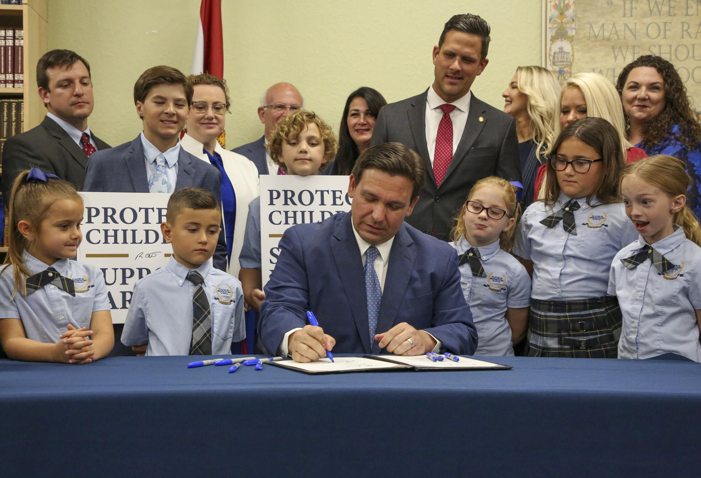
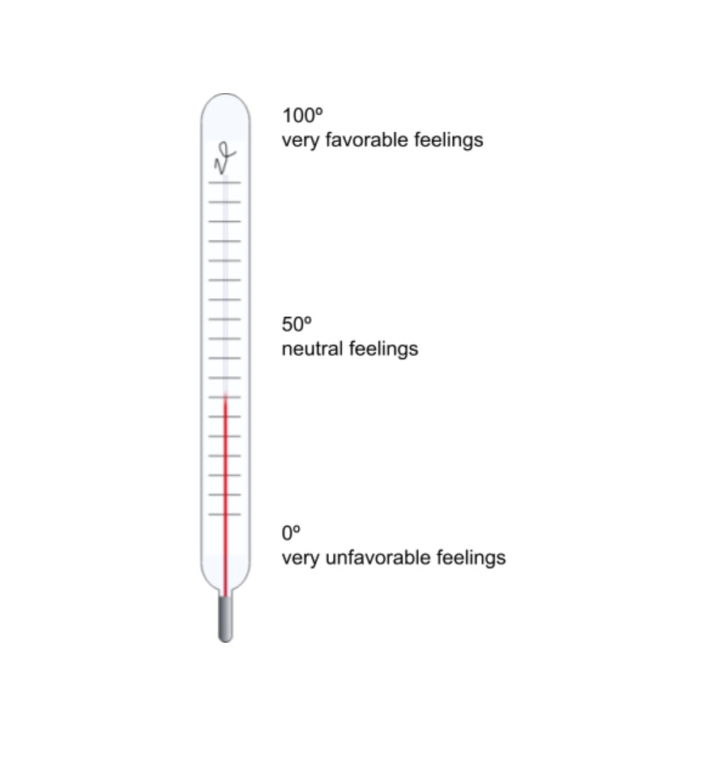
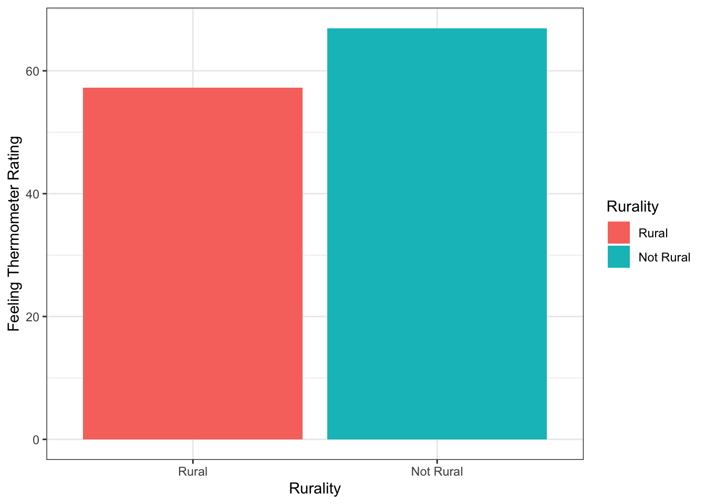
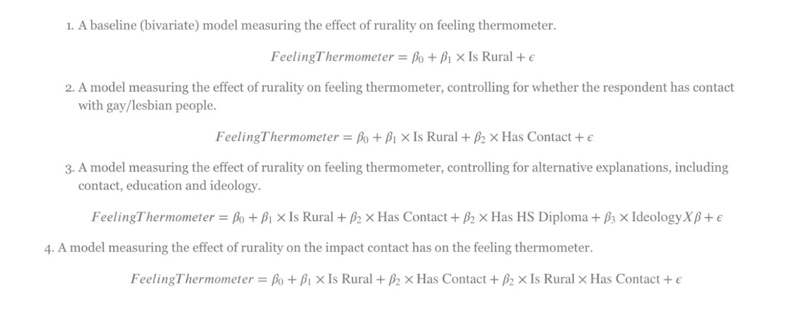
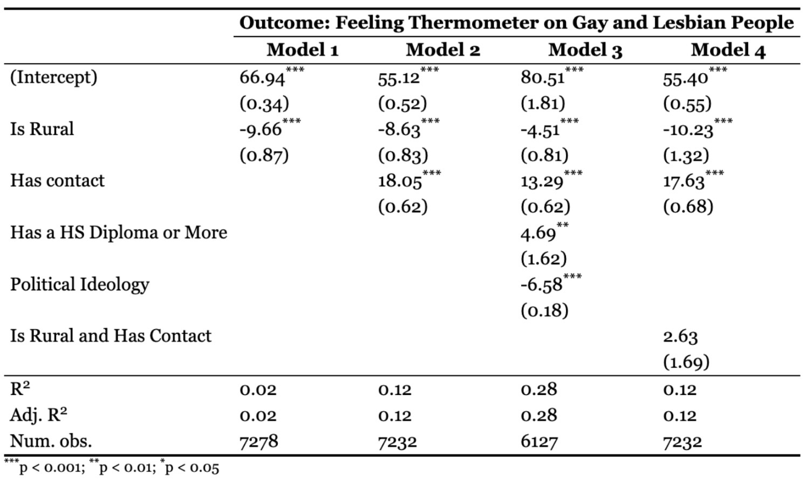

```{r setup, include=FALSE}
options(htmltools.dir.version = FALSE)
knitr::opts_chunk$set(
  warning = FALSE, 
  message = FALSE, 
  comment = NA, 
  dpi = 300,
  fig.align = "center", 
  out.width = "80%", 
  cache = TRUE)

xaringanExtra::use_tile_view()

htmltools::tagList(
  xaringanExtra::use_clipboard(
    button_text = "<i class=\"fa fa-clipboard\"></i>",
    success_text = "<i class=\"fa fa-check\" style=\"color: #90BE6D\"></i>",
  ),
  rmarkdown::html_dependency_font_awesome()
)

# Setup
the_packages <- c(
  ## R Markdown
  "kableExtra","DT","texreg",
  ## Tidyverse
  "tidyverse", "lubridate", "forcats", "haven", "labelled",
  ## Extensions for ggplot
  "ggmap","ggrepel", "ggridges", "ggthemes", "ggpubr", 
  "GGally", "scales", "dagitty", "ggdag", "ggforce",
  # Graphics:
  # Data 
  "COVID19","maps","mapdata","qss","tidycensus", "dataverse", 
  # Analysis
  "DeclareDesign", "zoo"
)

ipak <- function(pkg){
    new.pkg <- pkg[!(pkg %in% installed.packages()[, "Package"])]
    if (length(new.pkg)) 
        install.packages(new.pkg, dependencies = TRUE)
    sapply(pkg, require, character.only = TRUE)
}

ipak(the_packages)
```


# Motivating Example: "Don't Say Gay" Bill

```{r, echo=F, fig.height=7}
# Include impage from the web
# Include impage from the web

# library(tidycensus)
# v17 <- load_variables(2017, "acs5", cache = TRUE)
# 
# View(v17)
```

---
# Research Questions

- Does geographical setting influence feelings towards gay people? If so, why?

- Does acceptance of gay people depend on level of contact?

- Is contact the main influence of attitude, regardless of geolocation?

- Within rural communities, does political leaning affect acceptance of gay people?

- Within rural communities, does education level affect acceptance of gay people?

---
# Project Variables

Key Predictor Variables: 

- Geographic location

Coviarites Within Rural Respondents:

- Contact with gay people

- Effect of political leaning on acceptance of gay people

- Effect of education on acceptance of gay people

---
# Outcome
```{r, echo=F, fig.height=7}
# Include impage from the web

# library(tidycensus)
# v17 <- load_variables(2017, "acs5", cache = TRUE)
# 
# View(v17)
```


---
# Theory 

LGBTQ in America:
- 2.9-3.9 million of LGBTQ people live in rural America out of at least 20 million total
- Residents of rural communities tend to be less supportive of LGBTQ people

Existing Theories Explaining Theories Explaining Rural Attitudes:
- Religious institutions
- Visibility
- Education
- Partisanship
- Contact theory

---
# Expectations

Does geographical setting influence feelings towards gay people? If so, why?
- We expected that respondents from rural areas would place themselves lower on the feeling thermometer than urban respondents. 

Does acceptance of gay people depend on level of contact?
- In keeping with the contact hypothesis, we expected that respondents that reported higher levels of contact with gay people in their close community would place themselves higher on the feeling thermometer.

Within rural communities, does political leaning affect acceptance of gay people?
- We expected that respondents with more conservative political leanings would place themselves lower on the feeling thermometer than liberal respondents. 

Within rural communities, does education level affect acceptance of gay people?
- We expected that respondents having graduated high school would place themselves higher on the feeling thermometer.


---
# Data (Outcome and Key Predictor)

American National Election Studies (ANES) 2020 Time Series Study Full Release
8,280 observations 

Outcome (Feeling Thermometer): “How would you rate: Gay men and lesbians?”
- Scale of 0 to 100

Key Predictor (Rurality): “Do you currently live in a rural area, small town, suburb, or city?”
- 1: Rural, 2: Small town, 3: Suburb, 4: City
- Recoded → 1: Rural, 0: Not rural

---
# Data (Covariates)

Covariate 1 (Contact): “Among your immediate family members, relatives, neighbors, co-workers, or close friends, are any of them gay, lesbian, or bisexual as far as you know?”
- 1: Yes, 2: No

Covariate 2 (Education):“What is the highest level of school you have completed or the highest degree you have received?”
- 1: Less than high school credential - 8: Professional School degree
- Recoded → 1: At least a high school diploma or equivalent, 0: Less than a high school diploma

Covariate 3 (Ideology): “Where would you place yourself on this scale, or haven’t you thought much about this?”
- 1: Extremely liberal, 2: Liberal, 3: Slightly Liberal, 4: Moderate, 5: Slightly 
    
---
## Descriptive Data Visualization 

<center> 
Feeling Thermometer Ratings and Rurality 
</center>

<center>
```{r, echo=F, fig.height=7}
# Include impage from the web

# library(tidycensus)
# v17 <- load_variables(2017, "acs5", cache = TRUE)
# 
# View(v17)
```
</center>


---
# Design

```{r, echo=F, fig.height=7}
# Include impage from the web

# library(tidycensus)
# v17 <- load_variables(2017, "acs5", cache = TRUE)
# 
# View(v17)
```

- Inverse relationship between rurality and positive feelings toward gay people & conservativeness and positive feelings toward gay people

- Direct relationship between having contact with gay people and positive feelings toward gay people & having a high school diploma and positive feelings toward gay people (although not statistically significant)

---
# Results: 

Consistent with expectations, feeling thermometer ratings dropped for respondents living in rural areas

When controlling for contact, magnitude of negative relationship between rurality and feeling thermometer rating decreased
- But contact hypothesis only accounts for small portion of the negative relationship between rurality and feeling thermometer ratings

Positive correlation between having a high school diploma and feeling thermometer ratings

Inverse relationship between how conservative respondents are, and how highly they rate their feelings towards gay and lesbian people on the feeling thermometer 

If a respondent is rural, having contact raised their feeling thermometer rating to a larger extent than for respondents who do not live in rural areas. 

---
# Results: Regression Table

```{r, echo=F, fig.height=7}
# Include impage from the web

# library(tidycensus)
# v17 <- load_variables(2017, "acs5", cache = TRUE)
# 
# View(v17)
```

---
# Results: Predicted Values

```{r, echo=F, fig.height=7}
# Include impage from the web
knitr::include_graphics("fig5-1.png")
# library(tidycensus)
# v17 <- load_variables(2017, "acs5", cache = TRUE)
# 
# View(v17)
```

---
# Conclusion

- We set out to learn how where people live (rural versus urban) affects their feeling thermometer toward gay people. We also drew upon the contact hypothesis, where intergroup contact between gay people and non-gay people can reduce prejudice against gay people. 

- We found that people have more favorable views of gay people when they live in more urban areas.

- It is difficult to determine whether views on homosexuality are a result of contact with gay people or if contact with gay people is determined by views on homosexuality. In addition, it is challenging to control for all variables that may affect people’s feeling thermometers, such as religion, age, and personal sexuality. 

- Future research should look at how people’s views toward gay people change over time, like before versus after college.

---
```{r, echo=F, fig.height=7}
# Include impage from the web

# library(tidycensus)
# v17 <- load_variables(2017, "acs5", cache = TRUE)
# 
# View(v17)
```


---
# References
Clifford, Douglas R. “Florida Gov. Ron DeSantis Signs the Parental Rights in Education Bill at Classical Preparatory School Monday, March 28, 2022 in Shady Hills, Fla. (Douglas R. Clifford/Tampa Bay Times via AP).” AP News, Tampa Bay Times, 28 Mar. 2022, https://apnews.com/article/florida-dont-say-gay-law-signed-56aee61f075a12663f25990c7b31624d

Harrison, Brian F, and Melissa R Michelson. 2019. “Contact Theory and the Distinct Case of LGBT People and Rights.” *Oxford Research Encyclopedia of Politics*. https://oxfordre.com/politics/view/10.1093/acrefore/9780190228637.001.0001/acrefore-9780190228637-e-1174.

Nickerson, Charlotte. “Allport's Intergroup Contact Hypothesis: Its History and Influence.” *Allport's Intergroup Contact Hypothesis: Its History and Influence - Simply Psychology*, 21 July 2021, https://www.simplypsychology.org/contact-hypothesis.html.

“2020 Time Series Study - Anes: American National Election Studies.” 2022. *ANES | American National Election Studies*. https://electionstudies.org/data-center/2020-time-series-study/.

“LGBT Rural Report - Advancement Project.” 2019. https://www.lgbtmap.org/file/lgbt-rural-report.pdf.
