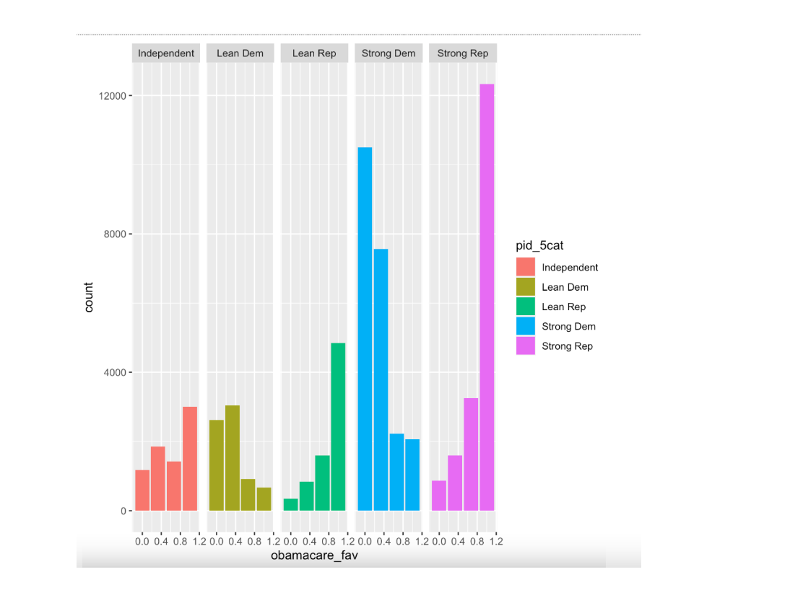
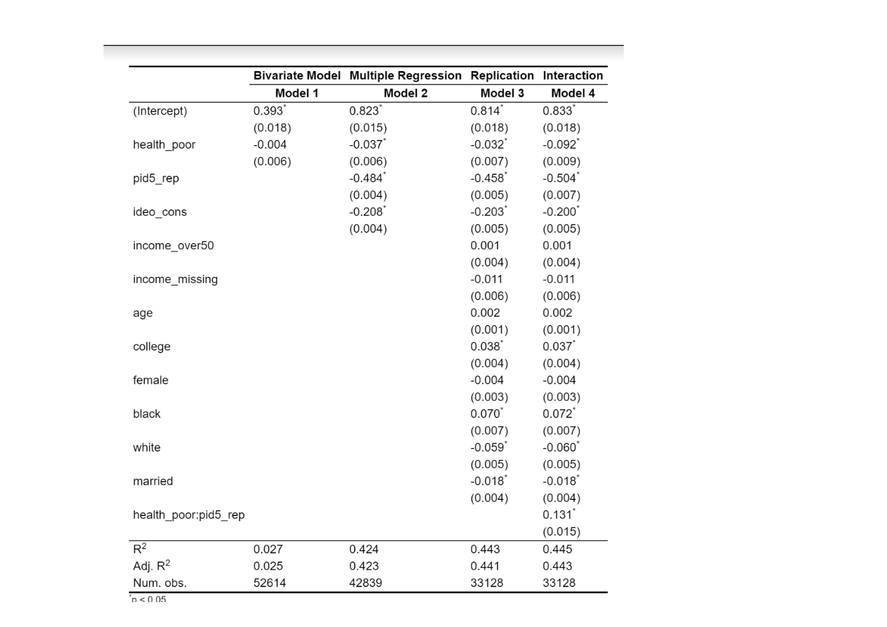
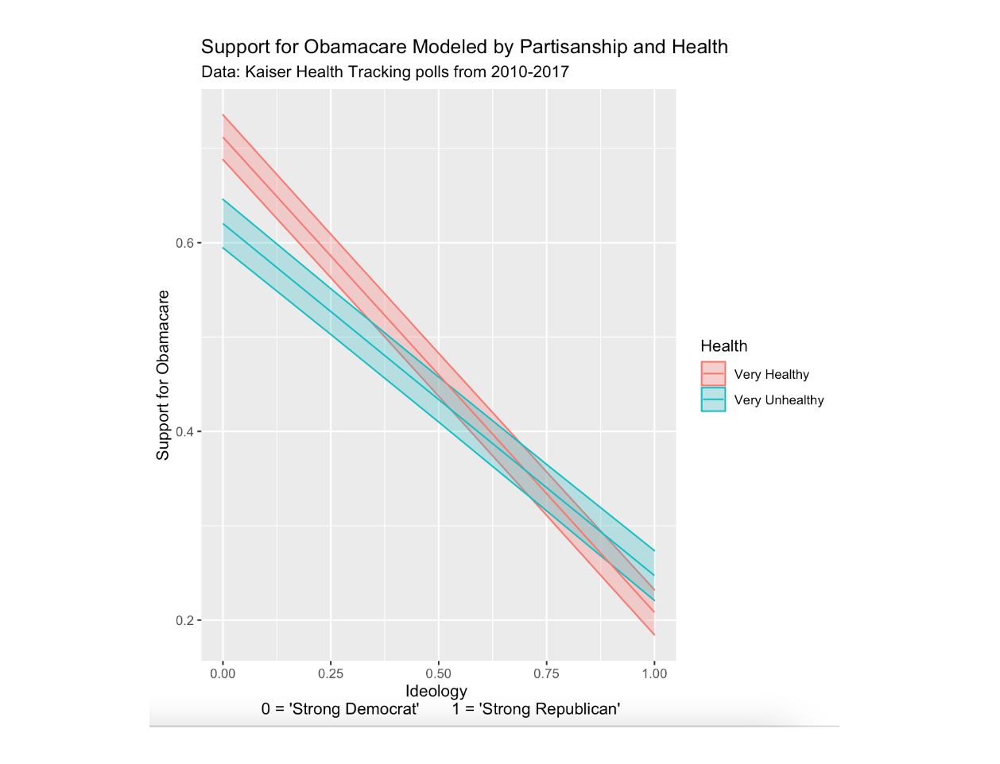

```{r setup, include=FALSE}
options(htmltools.dir.version = FALSE)
knitr::opts_chunk$set(
  warning = FALSE, 
  message = FALSE, 
  comment = NA, 
  echo=F,
  dpi = 300,
  fig.align = "center", 
  out.width = "80%", 
  cache = FALSE)

xaringanExtra::use_tile_view()
 
htmltools::tagList(
  xaringanExtra::use_clipboard(
    button_text = "<i class=\"fa fa-clipboard\"></i>",
    success_text = "<i class=\"fa fa-check\" style=\"color: #90BE6D\"></i>",
  ),
  rmarkdown::html_dependency_font_awesome()
)

# Setup
the_packages <- c(
  ## R Markdown
  "kableExtra","DT","texreg",
  ## Tidyverse
  "tidyverse", "lubridate", "forcats", "haven", "labelled",
  ## Extensions for ggplot
  "ggmap","ggrepel", "ggridges", "ggthemes", "ggpubr", 
  "GGally", "scales", "dagitty", "ggdag", "ggforce",
  # Graphics:
  # Data 
  "COVID19","maps","mapdata","qss","tidycensus", "dataverse", 
  # Analysis
  "DeclareDesign", "zoo"
)

ipak <- function(pkg){
    new.pkg <- pkg[!(pkg %in% installed.packages()[, "Package"])]
    if (length(new.pkg)) 
        install.packages(new.pkg, dependencies = TRUE)
    sapply(pkg, require, character.only = TRUE)
}

ipak(the_packages)
```


# Motivating Example


```{r,echo=FALSE,out.width="49%", out.height="20%",fig.cap="How do we get here?",fig.show='hold',fig.align='center'}
knitr::include_graphics("https://www.gannett-cdn.com/authoring/2012/03/27/NSJR/ghows-LS-4dde3d21-c088-4c6d-9f0c-dc5271d37c79-34aa4c4a.jpeg?width=1200&disable=upscale&format=pjpg&auto=webp")
knitr::include_graphics("https://www.wealthmanagement.com/sites/wealthmanagement.com/files/healthcare-signs-aca.jpg")
```

---
# Research Question

- The Affordable Care Act (ACA), also known as “Obamacare,” is a series of health insurance reforms aimed at expanding healthcare to more Americans. It was signed into law in March 2010. The main goal of ACA was to increase coverage to uninsured Americans. 

- We modeled our study after the Reny and Sears article “Symbolic politics and self-interest in post-Affordable Care Act Health Insurance Coverage,” and went further in depth 

- For this study, we wanted to find out how partisanship and individual self-interests interact to form people's opinions on policy.  


---
# Theory 

- Sears defines symbolic politics saying, "By this line of thinking, people acquire stable affective preferences through conditioning in their pre-adult years with little consideration of the future costs and benefits of these attitudes.” (Sears, 1980).  The most important of these are presumably some general predispositions such as party identification, liberal or conservative ideology, nationalism, or racial prejudice." (We focus on partisanship)

- Self-interest draws on the rational choice model, which assumes people will do what benefits them the most.  

- We measure people's self-interest through their health status (health_poor) and we measured partisanship (one aspect of symbolic politics) through the party they identify with. (Pid5_rep) 

- We first control for partisanship and ideology when assessing people's opinion of ACA (obamacare_fav) and then we test the interaction between partisanship and self-interest to see what changes.  Will a Republican in poor health be more likely to support ACA than a Republican in good health? What about a Democrat? We will find out. 
---
# Expectations

- Reny and Seers ultimately concluded that individual self-interest was trumped by what they defined as symbolic politics (Partisanship and Self-Interest)

- A critic of this study, scholar W.D. Crano responds to this assertion with saying "a more intense integration of self-interest and symbolic politics is precisely what is needed," which is what we attempt to do. 

- We attempt to provide this integration by measuring the effects of partisnaship, self-interest, and their interactions through linear regression.   

- If Sears is correct in that self-interest has little to no effect on people’s opinions on ACA, we should expect to see no change between the linear regression model of Republicans’ opinion on ACA alone versus the regression model of Republicans and conservatives with poor health.

---
# Data (Overview)

- We used the dataset Reny and Sear’s article called “Merged_Kaiser.Tab” from Harvard Dataverse.

- In this dataset, there are 80969 observations, each observation being a person who answered the polling questions.

- The key predictors (Independent Variables)  in our data set are health and partisanship.  The outcome (Dependent Variable) is opinion of Obamacare. 

- These variables were tested via survey questions put on a scale from 0 to 1. Some these variables were re-coded for ease of use.

- DV: Opinion of Obamacare
  - (1=very favorable, 0.66=somewhat favorable, 0.33=somewhat unfavorable, 0=very unfavorable; mean=0.55, sd=0.40)

---
# Data (Key Predictors)
  
- IV: Health and Partisanship
  - Health: (1=poor, 0.75=fair,0.5=good,0.25=very good, 0=excellent; mean=0.36, sd=0.27)
  - Partisanship: (1=strong republican, 0.75=lean republican, 0.5=independent, 0.25=lean democrat, 0=democrat; mean = 0.46, sd=0.41)
 
  
   *We also controlled for ideology, measured on a numeric scale.  Participants were asked, participants were asked, “Would you say your views in most political matters are liberal, moderate, or conservative?” (1=conservative, 0.5=moderate, 0=liberal; mean=0.57, sd=0.39). In our second model we also controlled for partisanship. 
---
#Data (Covariates)    
- Covariates: The covariates we controlled for were income, age, college, gender, race (Black/White), other race, married.
  - Income: (1=greater than $50k, 0=less than $50k; mean = 0.56, sd=0.49) 
  - Income Missing: dummy variable for item nonresponse on income (mean=0.11) 
  - Age: (1=18-29, 2=30-49, 3=50-64, 4=65+) 
  - College: (1=four-year college or greater, 0=less than four-year college; mean=0.41, sd=0.49)
  - Gender: (1=female,0=male; mean=0.50)
  - White: (mean=0.72)
  - Black: (mean=0.10)
  - Other Race: (mean=0.18)
  - Married: (mean=0.53)

---
# Distribution
```{r}

```

---
# Design

Model 1. A bivariate model testing self-interest and favorability of ACA:
- Obamacare_fav= 𝛽0 +𝛽1health_poor+ 𝜖

- We expect that this model will have a low coefficient for health_poor, indicating that it is not a powerful predictor for determining people’s opinions on ACA. 
   
Model 2. A multiple regression including controls for “symbolic interests” (partisanship and ideology)

- Obamacare_fav=𝛽0 +𝛽1health_poor+Pid5_rep + ideo_cons 

- This model will likely have little to no change in the slope of the regression line for the first model.  We predict that health status does not greatly affect whether or not someone is in favor of ACA, regardless of symbolic ideology.  When we control for “symbolic interests” we are measuring them and removing their effects from the dependent variable. These controlled categories are the covariates.

---
# Design 
    
Model 3. A full replication recreating the estimates in from lm.out in the code from Reny and Seers (2020): 
 -Obamacare_fav = 𝛽0 +𝛽1health_poor+Pid5_rep+ ideo_cons +income_over50 + income_missing + age + college + female + black + white + married + 𝜖

- This model controls for partisanship, ideology,  income, age, education, race, gender, and marital status.  We expect that the outcome will be similar to the first and third model. 
    
---
# Design Continued (Last Model We Promise)

Model 4. An extension of these results testing the interaction between partisanship and self-interest
 
- Obamacare_fav = 𝛽0 +𝛽1health_poor+ 𝛽2Pid5_rep+ 𝛽3(health_*Pid5_rep)+𝜖

- We predict that self-interest will have minimal effect on Republican an Democrats opinion of Obamacare. We expect to see a similar slope for Democrats and Republicans with poor health and with good health.  
 

---
# Results: Regression Table
```{r}

```

---
# Results:

- Model 1: The first model suggests that the relationship between health status (self-interest) and support for Obamacare is very slight. The coefficient is only -.004, suggesting that a unit increase in health/self-interest surprisingly leads to a decrease in ACA support; however, this shift is statistically insignificant due to its small number. We expected that isolating health as a predictor would show a significant positive relationship with ACA support. This result proves that self-interest alone is not a solid enough indicator for policy opinion at least in this case.

- Model 2: The second model uses a regression formula to test two new predictors, political leanings and ideology. The second model suggests something similar to the first. Once we control for partisanship, the coefficient remains relatively unchanged. Instead of 4%, we have 3.7%.

- Model 3:  The third model, our replication of the original article, also suggests something similar. Once we control for partisanship along with all these other statistics (age, race, etc.), it goes down to 3.2%


---
#Results Continued

- Model 4: Our results show that healthy Democrats are more likely to support Obamacare than unhealthy Democrats. But, healthy Republicans are less likely to support Obamacare than unhealthy Republicans. Although support for ACA is still high overall for all Democrats and low for all Republicans.   It seems as if self-interest interacts differently with those in opposite political leanings, and it does have a visible effect- albeit small.  

- The interaction coefficient the regression table generated was .131.  We inserted this into an interaction regression formula ( Obama_fav = 𝛽0 +𝛽1health_poor + 𝛽2Pid5_rep +𝛽3health_poor*Pid5_rep) and substituted the values of health_poor for both 0 (very healthy) and 1 (very unhealthy).  When we do this, we get two different lines.  For very unhealthy (1), we get Obama_fav= -.373Pid5_rep +.741.  For very healthy (0) we get a line of Obama_fav= -.504Pid5_rep+.833.  
---
# Results: Predicted Values 
```{r}

```
---
# Conclusion

- When we tested how self-interest interacts with symbolic politics, we found that unhealthy Republicans are more likely to support ACA than healthy Republicans.   We also found that healthy Democrats were more likely to support ACA than unhealthy Democrats.  This shows that self-interest interacts differently along partisan lines.  Perhaps self-interest has slightly more of an influence on those with conservative symbolic politics than it does on those with liberal politics when it comes to policy preferences. We need more data to make this claim, but our results definetly show that self-interest has an effect on the opinion of ACA and has different degrees of influence depending on where someone lies on the political spectrum.  It is significant over policy preferences that are divided along partisan lines and should not be overlooked.  

---
#Citations
- Crano, William D. “Vested Interest and Symbolic Politics—Observations and Recommendations: Reply to Sears (1997).” Journal of Personality and Social Psychology 72, no. 3 (1997): 497–500. https://doi.org/10.1037/0022-3514.72.3.497.

- “Merged_kaiser.Tab - Research & Politics Dataverse.” Accessed April 29, 2022. https://dataverse.harvard.edu/file.xhtml?persistentId=doi:10.7910/DVN/9LWIDA/RAGEJO&version=1.0.

- Reny, Tyler T., and David O. Sears. “Symbolic Politics and Self-Interest in Post-Affordable Care Act Health Insurance Coverage.” Research & Politics 7, no. 3 (July 1, 2020): 2053168020955108. https://doi.org/10.1177/2053168020955108.

- “Symbolic Politics and Self-Interest in Post-Affordable Care Act Health Insurance Coverage:” Research & Politics, September 11, 2020. https://doi.org/10.1177/2053168020955108.

- Sears, David O., Richard R. Lau, Tom R. Tyler, and Harris M. Allen. “Self-Interest vs. Symbolic Politics in Policy Attitudes and Presidential Voting.” American Political Science Review 74, no. 3 (September 1980): 670–84. https://doi.org/10.2307/1958149.


