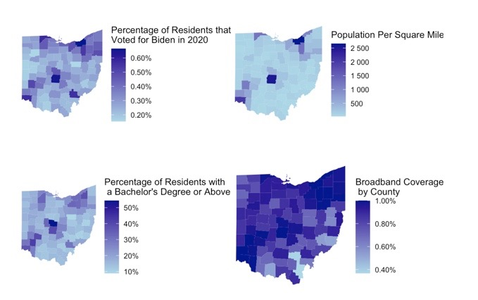
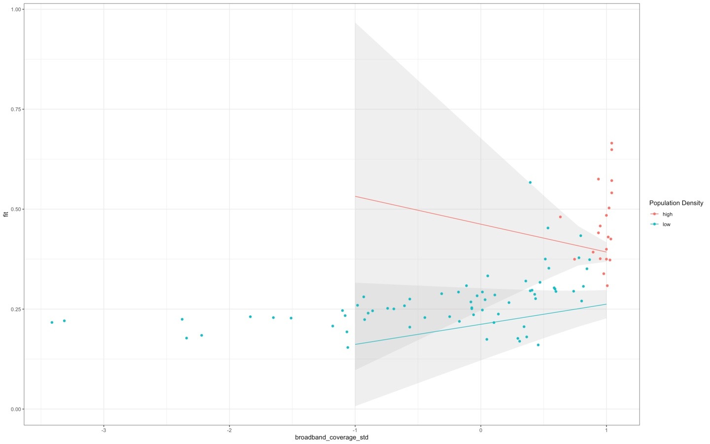

```{r setup, include=FALSE}
options(htmltools.dir.version = FALSE)
knitr::opts_chunk$set(
  warning = FALSE, 
  message = FALSE,
  echo = F,
  comment = NA, 
  dpi = 300,
  fig.align = "center", 
  out.width = "80%", 
  cache = TRUE)

xaringanExtra::use_tile_view()

htmltools::tagList(
  xaringanExtra::use_clipboard(
    button_text = "<i class=\"fa fa-clipboard\"></i>",
    success_text = "<i class=\"fa fa-check\" style=\"color: #90BE6D\"></i>",
  ),
  rmarkdown::html_dependency_font_awesome()
)

# Setup
the_packages <- c(
  ## R Markdown
  "kableExtra","DT","texreg",
  ## Tidyverse
  "tidyverse", "lubridate", "forcats", "haven", "labelled",
  ## Extensions for ggplot
  "ggmap","ggrepel", "ggridges", "ggthemes", "ggpubr", 
  "GGally", "scales", "dagitty", "ggdag", "ggforce",
  # Graphics:
  # Data 
  "COVID19","maps","mapdata","qss","tidycensus", "dataverse", 
  # Analysis
  "DeclareDesign", "zoo"
)

ipak <- function(pkg){
    new.pkg <- pkg[!(pkg %in% installed.packages()[, "Package"])]
    if (length(new.pkg)) 
        install.packages(new.pkg, dependencies = TRUE)
    sapply(pkg, require, character.only = TRUE)
}

ipak(the_packages)
```

class: inverse, bottom middle, center
background-image: url("coverimagePOLS1600.jpeg")
background-size:cover

# "Fake news" 
# Understanding the internet as a ~vessel~ of (mis)information

---
# Research Question

How, if at all, did access to broadband internet influence Democratic / Republican vote share in the 2020 presidential election?

---
# Theory 

Does increased access to broadband internet result in a higher Democratic vote share?

If yes, was access to broadband internet the key predictor in vote share distribution, or are there other variables that may better explain why individuals voted as they did in the 2020 presidential election?

Various literature provides potential responses to these questions: 

- Internet providers target areas with more "high-skilled" individuals with higher incomes when expanding and installing broadband networks. 

- Access to internet is more likely to increase polarization between parties than it is to sway voters from supporting one political party to the other. 


---
# Expectations

We decided to investigate the potential correlations between access to broadband internet and Democratic / Republican vote share by taking a closer look at Ohio. 

Why Ohio?
- The state was a swing state in the 2020 election 
- The state has a large rural population that correlates to the majority of its Republican vote share 
- The state was ranked 18/50 in BroadbandNow's annual rankings of internet coverage, speed and availability 

How best to determine correlation?
- Compare Democratic vote share to percentage of broadband coverage 
- Control for population density (a way to determine rural/urban classification within counties)
- Control for percentage of residents with at least a bachelor's degree (a marker for income level)

---
# Data

  - Sources: BroadbandNow 2020 internet accessibility ranking, 2020 U.S. Census Bureau data 
  
  - Number of Observations: we looked at data across all 88 counties of Ohio
  
  - Unit of Analysis: individuals in each of Ohio's counties
  
  - Outcome Variable: percentage of Democratic vote share per county
  
  - Key Predictor: percentage of county with access to broadband internet
  
  - Covariates: population density, percentage of individuals per county with at least a bachelor's degree
    
---
# Data Visualizations

```{r}


```


---
# Design

We cleaned and compiled a data set with our key predictor and covariates by county

- Including: percentage Democratic vote share; percentage of county with broadband coverage (key predictor); population density (covariate); percentage of residents with at least a bachelor's degree (covariate)

And fit the following models: 

$$\text{Dem Vote Share} = \beta_0 + \underbrace{\beta_1}_{(+)} \text{Broadband Access} + \epsilon$$
$$\text{Dem Vote Share} = \beta_0 + \underbrace{\beta_1}_{(+)} \text{Broadband} + \underbrace{\beta_2}_{(++)} \text{Population Density} + \underbrace{\beta_3}_{(+++)} \text{BA Degree}+\epsilon$$
We expected that attainment of a bachelor's degree would correlate most significantly with Democratic vote share.   

---
# Results: Regression Table

```{r}
knitr::include_graphics("regressiontable.jpeg")

```

---
# Results:

Looking at Model 1: positive correlation between broadband and vote share (as expected!)

BUT

The skeptics ask... what else could explain that correlation?
- Population Density
- Educational Attainment (at least a bachelor's degree)

Model 2 shows: maybe the skeptics are right

Model 3 is a bit more complicated... 

---
# Modeling predictions:

```{r}


```


---
# Conclusion

Does increased access to broadband internet result in a higher Democratic vote share?
- More specifically, how, if at all, did access to broadband internet impact Democratic / Republican vote share in Ohio in the 2020 presidential election? 

The moral of the story... 

Access to broadband internet did not have as significant of an impact on 2020 Democratic vote share as our other covariates. 

---
class: inverse, bottom middle, center
background-image: url("jebmeme.jpeg")
background-size:cover

# Ultimately, it doesn't matter. Jeb won. 
