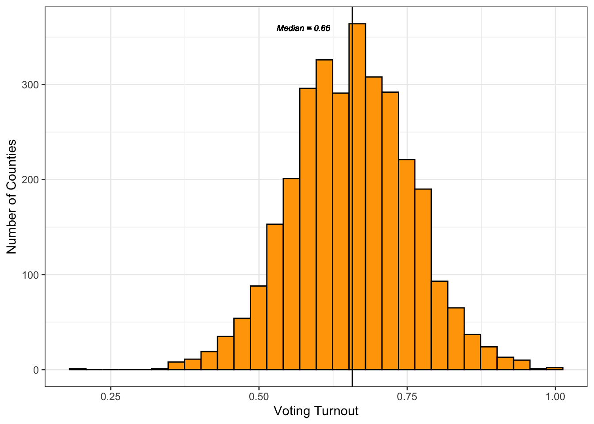
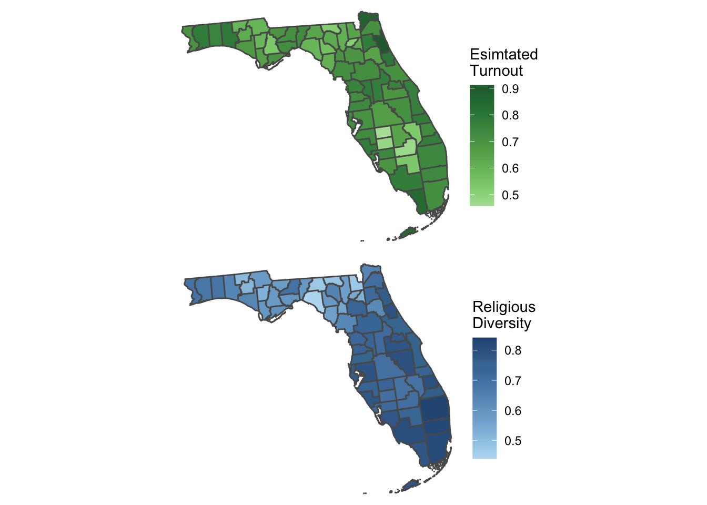
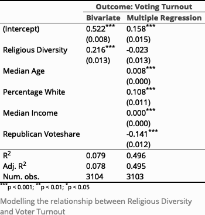
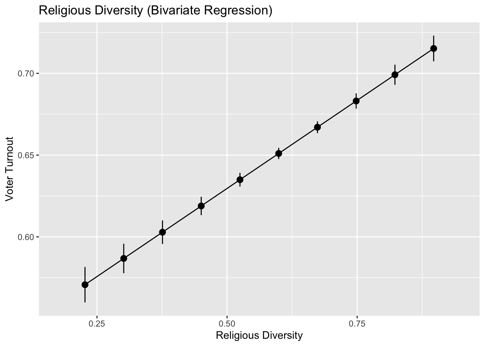
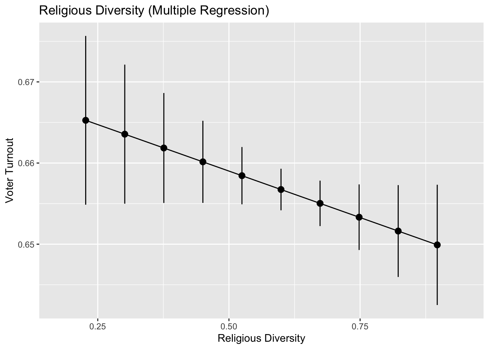

```{r setup, include=FALSE}
options(htmltools.dir.version = FALSE)
knitr::opts_chunk$set(
  warning = FALSE, 
  message = FALSE, 
  comment = NA, 
  dpi = 300,
  fig.align = "center", 
  out.width = "80%", 
  cache = FALSE)

# xaringanExtra::use_tile_view()
# 
# htmltools::tagList(
#   xaringanExtra::use_clipboard(
#     button_text = "<i class=\"fa fa-clipboard\"></i>",
#     success_text = "<i class=\"fa fa-check\" style=\"color: #90BE6D\"></i>",
#   ),
#   rmarkdown::html_dependency_font_awesome()
# )

# Setup
the_packages <- c(
  ## R Markdown
  "kableExtra","DT","texreg",
  ## Tidyverse
  "tidyverse", "lubridate", "forcats", "haven", "labelled",
  ## Extensions for ggplot
  "ggmap","ggrepel", "ggridges", "ggthemes", "ggpubr", 
  "GGally", "scales", "dagitty", "ggdag", "ggforce",
  # Graphics:
  # Data 
  "COVID19","maps","mapdata","qss","tidycensus", "dataverse", 
  # Analysis
  "DeclareDesign", "zoo"
)

ipak <- function(pkg){
    new.pkg <- pkg[!(pkg %in% installed.packages()[, "Package"])]
    if (length(new.pkg)) 
        install.packages(new.pkg, dependencies = TRUE)
    sapply(pkg, require, character.only = TRUE)
}

ipak(the_packages)
```


# The United States is comprised of people from a vast array of different faiths and religions


```{r, echo=F, fig.height=7}
# Include impage from the web
knitr::include_graphics("https://d36tnp772eyphs.cloudfront.net/blogs/1/2017/06/religions-US.jpg")

```


---
# 

.pull-left[

> "Religion is here to unite us. It's not here to divide us. If it's dividing us, it's not God's religion, it's something else." Hamza Yusuf

]

.pull-right[


]

---
# Research Question

* In this study we look at the relationship between United States voter turnout and county-level religious diversity

* What fosters higher voter turnout in American counties: religious homogeneity or religious diversity?   

* Many factors motivate Americans to vote including _civic duty, party affiliation, political ideology, local and nation issues, affinity with a certain candidate, stopping an unfavorable candidate from taking office, socioeconomic class, race, sex, religion, and many more_

* Our inquiry is based on **_religious diversity_**, exploring voter turnout in counties with respect to their respective religious diversity


---
# Theory 

* The motivation for this study is the unique religious landscape of the United States: it is the most religious wealthy country in the world by far, yet does not rank highly in terms of overall religious diversity

* Levels of religious diversity also range drastically in different counties in the United States, from diverse big cities to homogeneous Protestant Christian towns 

* Religious institutions serve as community centers and hubs for followers to exchange ideas and share viewpoints related to both religion and politics


---
# Theory

* **Religiously Homogeneous Counties**
  + In spaces of religious homogeneity, people agree on a lot; after all, to share a religion is to share a common morality, to view issues and events from a common point of understanding
  
  + In this kind of environment, messages spread quickly, like in an **_echo chamber_**
  
  + One may feel more motivated to vote because of social pressure from clergymembers and other members of their religious community
  
* **Religiously Diverse Counties**
  + On the other hand, exposure to different viewpoints in religiously-diverse counties can also motivate engagement in political activities
  
  + People in religiously diverse counties may feel a greater urgency to engage in electoral politics in order to feel like their religiously-motivated views on certain issues are being properly represented in the political sphere
  
  + The more religiously diverse a county is, the more conflicting opinions there are, which can encourage people to vote for their interests

---
class:inverse, middle, center
background-image: url("https://religionnews.com/wp-content/uploads/2022/03/webRNS-Diverse-Team-Work2-040122-1536x1024.jpg")
bacground-size: cover

# Expectations


---
# Predicting the Relationship

* Why it could be **Negative** 
  + _Social Capital_: Religious institutions are better equipped to impart followers with social capital in communities that are dominated by one religion
  
  + _Herd Mentality_: A 2013 study looking at how social influence can affect voter turnout found that "close friends exerted about four times more influence on the total number of validated voters mobilized than the message itself...efforts to influence behaviour should pay close attention not only to the effect a message will have on those who receive it but also to the likelihood that the message and the behaviour it spurs will spread from person to person through the social network." (_Robert Bond, Christopher Fariss, et. al_)
  

---
# Predicting the Relationship

* Why it could be **Positive**  
  + the more diverse, the more conflict there will be, which will encourage people to vote for their interests.
 
* Why there could be **No Relationship**
  + The importance of religion in people’s lives is decreasing in the United States.
  + Pew: The U.S. ranks 68th out of 232 countries and territories in terms of religious diversity.
  + Religiously-unaffiliated people are the fastest growing religious group in the U.S. 
  
---
class:inverse, middle, center
background-image: url("https://religionnews.com/wp-content/uploads/2022/03/webRNS-Diverse-Team-Work2-040122-1536x1024.jpg")
bacground-size: cover

# Data


---
# Data

* Sources
    + Census Data 2020: American Community Survey
        - County, Median Income, Median Age, Total White Population, Total Population Providing Race, Total Voting Age Population
 
    + Dataverse Voting Data: MIT
        - FIPS (county code), State, County Name, Party, Candidate Votes, Total Votes

    + The 2020 Census of American Religion: PRRI
        - Religious diversity (index of religious diversity)

---
# Data

* Number of observations
    + 3104 observations (counties)
  
* Unit of analysis
    + We looked at U.S. counties by religious diversity and voter turnout.
  
* Measures
    + Religious Diversity: “an index developed to measure variations in the concentration of global religious populations. The index is calculated so that a score of 1 signifies complete diversity—every religious group is of equal size—and a score of 0 indicates a complete lack of diversity and one religious group comprises the entire population of a given county.”
    + Median Age: years
    + Percentage White: racial diversity
    + Median Income: dollars
    + Republican Vote Share: percentage who voted for Trump out of the total votes
  
---
# Data

* Outcomes: Positive correlation for bivariate model, but no correlation after using multiple regression to control for covariates

* Key predictor: Religious Diversity

* Covariates: Median Age, Percentage White, Median Income, Republican Vote Share
    
---
# Distribution of Voting Turnout  

```{r echo=F}


``` 

---

```{r echo=F}


``` 


---
class:inverse, middle, center
background-image: url("https://religionnews.com/wp-content/uploads/2022/03/webRNS-Diverse-Team-Work2-040122-1536x1024.jpg")
bacground-size: cover

# Design


---
# Design

* Empirical Design
  + We are testing whether religious diversity is a predictor of voter turnout, using county-level data from the 2020 presidential election
  + We are testing this with a simple bivariate model, as well as a multiple regression model that controls for age, race, income, and partisan affiliation, since these are variables that may impact voter turnout
  
* Bivariate Model

$$\text{Voting Turnout} = \beta_0 + \beta_1 \text{Religious Diversity}$$
* Multiple Regression Model

$$\text{Voting Turnout} = \beta_0 + \beta_1 \text{Religious Diversity} + \beta_2 \text{Age} + \beta_3 \text{Race}$$
$$+ \beta_4 \text{Income} + \beta_5 \text{Partisan Affiliation}$$
---
# Design

* What do your expectations imply for the sign, size and signficance of coefficients?
  
  + Coefficient sign: If negative, that means higher religious diversity and lower turnout. If positive, that means higher religious diversity and higher turnout
  
  + Size: We would expect the coefficient size to be particularly small for income, where the scale of the predicting variable is much larger
  
  + Significance: Each coefficient indicates the average outcome for the given condition, or the increase in the average outcome associated with a one-unit increase in religious diversity (although in this case, religious diversity ranges from 0 to 1)


---
# Results 

* Before controlling for other possible predictors, there seemed to be a positive correlation between religious diversity and voter turnout, meaning that as religious diversity increased, voter turnout did too 

* However, after controlling for the variation in outcome that could be explained by other predictors, there was no relationship between religious diversity and voter turnout 

* The estimates vary from one model to the next because in the first model, there was no way of knowing how much of the variation in voter turnout was actually attributable to religious diversity, as it showed a simple linear relationship between religious diversity and voter turnout, while the second model was able to show how the relationship changes when other predictors are taken into account

---

```{r echo=F}


``` 


---

```{r echo=F}


``` 


---

```{r echo=F}


``` 


---
class:inverse, middle, center
background-image: url("https://religionnews.com/wp-content/uploads/2022/03/webRNS-Diverse-Team-Work2-040122-1536x1024.jpg")
bacground-size: cover

# What is the relationship between religious diversity and political outcomes?


---
# Conclusions

* In this study, we found that there is not a statistically significant relationship between religious diversity and voter turnout

* The most common religious denomination in the United States is Christianity, making up 63% of Americans. However, the portion of self-identifying Christians is decreasing, having made up 75% of the population a decade ago

* “Religiously non-affiliated” is now the fastest growing religious group in the U.S., increasing 10 points in the last ten years. All other non-Christian communities are increasing as well, which include Buddhists, Hindus, Jews, and Muslims. Switching religions is also becoming increasingly more common: 42% of Americans have switched religions during their lifetimes

---
# Conclusions
* These trends indicate that religiously homogeneous “echo-chamber”-like communities are decreasing as the United States becomes more religiously diverse 

* As the United States has become more religiously mixed, voting rates have actually increased

* More people voted in 2020 than in any election since at least the 1980s, with 66.8% of U.S. adults casting a ballot

* Voting rates increased in every single state, indicating increased turnout was a local trend just as much as it was a national one

* With both religious diversity and voter turnout increasing in sizable numbers on both a national and local level, it seemed unlikely that county-level religious diversity could have a negative correlation with voter turnout

---
# Conclusions

* Because US is more homogenous religiously, it might make more sense to use other countries that have more variance in religious diversity 

* Looking at places/religious diversity over time, rather than in just one specific moment could provide more substantial results


