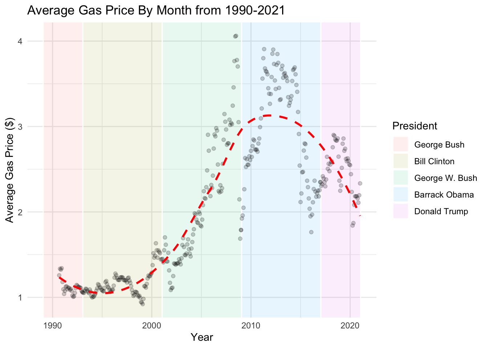
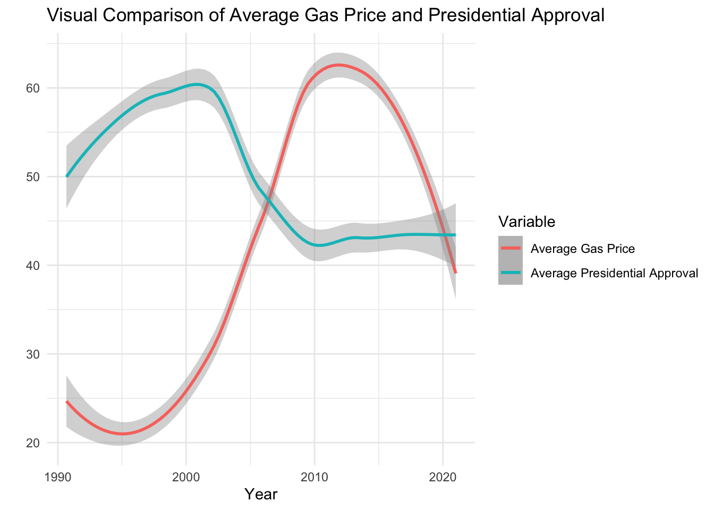
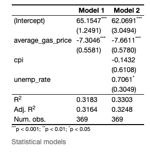
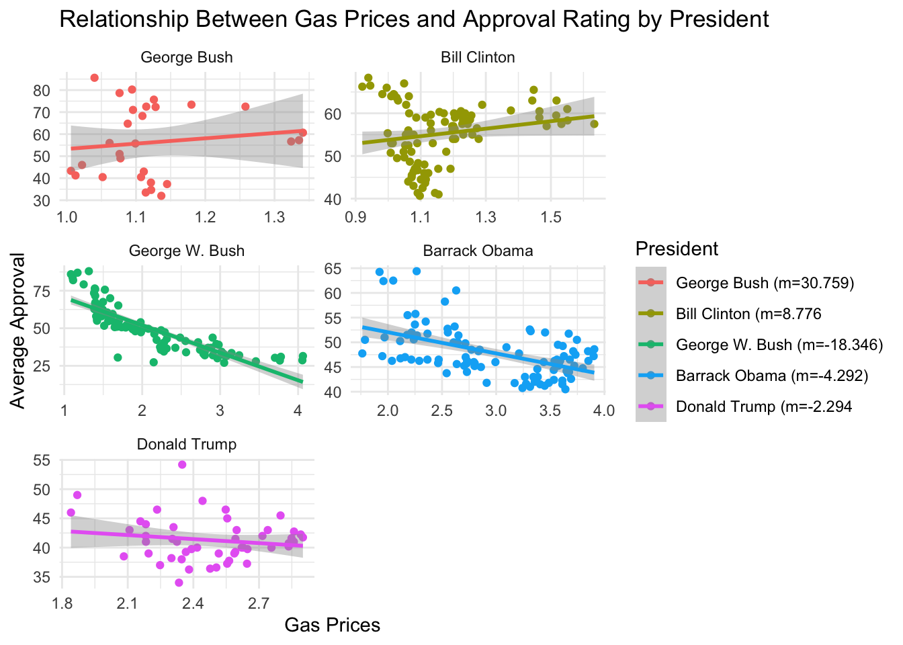
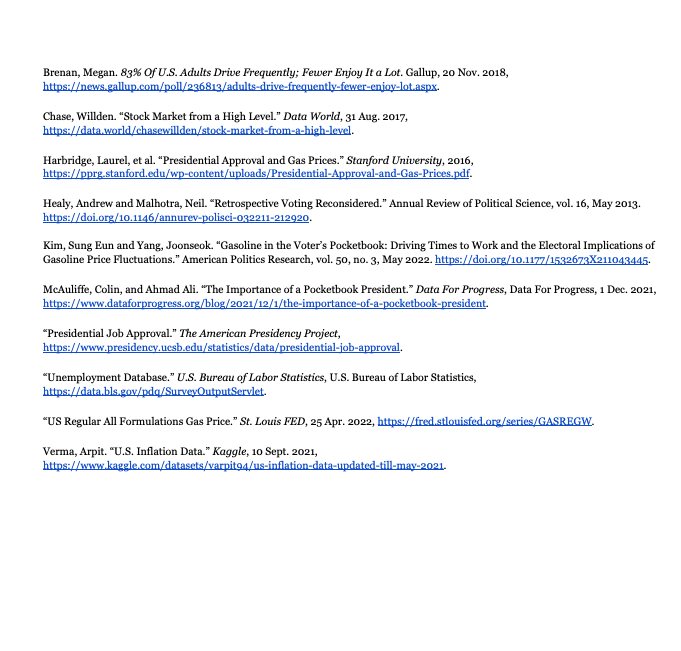

```{r setup, include=FALSE}
options(htmltools.dir.version = FALSE)
knitr::opts_chunk$set(
  warning = FALSE, 
  message = FALSE, 
  comment = NA, 
  dpi = 300,
  fig.align = "center", 
  out.width = "80%", 
  cache = FALSE)

xaringanExtra::use_tile_view()

htmltools::tagList(
  xaringanExtra::use_clipboard(
    button_text = "<i class=\"fa fa-clipboard\"></i>",
    success_text = "<i class=\"fa fa-check\" style=\"color: #90BE6D\"></i>",
  ),
  rmarkdown::html_dependency_font_awesome()
)

# Setup
the_packages <- c(
  ## R Markdown
  "kableExtra","DT","texreg",
  ## Tidyverse
  "tidyverse", "lubridate", "forcats", "haven", "labelled",
  ## Extensions for ggplot
  "ggmap","ggrepel", "ggridges", "ggthemes", "ggpubr", 
  "GGally", "scales", "dagitty", "ggdag", "ggforce",
  # Graphics:
  # Data 
  "COVID19","maps","mapdata","qss","tidycensus", "dataverse", 
  # Analysis
  "DeclareDesign", "zoo"
)

ipak <- function(pkg){
    new.pkg <- pkg[!(pkg %in% installed.packages()[, "Package"])]
    if (length(new.pkg)) 
        install.packages(new.pkg, dependencies = TRUE)
    sapply(pkg, require, character.only = TRUE)
}

ipak(the_packages)
```


# Why Care about Gas Prices? 

As gas prices have been surging these past couple months, many Americans, namely Republicans, have blamed Biden and his administration. 


```{r, echo=F, fig.height=7}
# Include image from the web
knitr::include_graphics("https://compote.slate.com/images/4ed7649d-a565-4c59-bafc-9e1b72cae157.jpeg?width=780&height=520&rect=1560x1040&offset=0x0")

```


---
# President Biden and Gas Prices

.pull-left[

> “‘Joe Biden caused this and doesn’t seem to care,’ the Republican National Committee’s deputy communications director tweeted, echoing the stickers that Trump-voting motorists have been slapping onto gas pumps across the country.”

]

.pull-right[


]

---
class:inverse, middle, center
background-image: url("https://pbs.twimg.com/media/FQJfjPEXIAUdgQ1?format=jpg&name=900x900")


---
# Research Question

Do rising gas prices negatively impact American incumbent presidential job approval?

How do gas prices compare to other economic factors like unemployment and inflation, in terms of their respective affects on presidential approval rating?
```{r, echo=F, fig.height=6}
# Include image from the web

```

---
# Theoretical Framework 

- Health of the nation’s economy identified as key input influencing opinion of government

 - Evaluations of national politicians are determined by perceptions of the national economy (Harbidge et al., 2016) 

 - Performance judged on objective economic indicators like unemployment or inflation

- Gas prices are an important, yet historically neglected variable (Harbridge et al., 2016)

 - 83% of Americans regularly drive; thus, most Americans directly affected by gas prices (Brennan, 2018).

 - Gas prices are highly visible, they are politically more accessible and traceable (Kim and Yang, 2021)

 - Gas price fluctuations over time typically impact most regions similarly


---
# Expectations

- We expect the relationship between gas prices and presidential approval to be negative and statistically significant, indicating that high gas prices negatively influence presidential approving ratings. 

- If gas prices are particularly salient because of their high visibility, high traceability, and their direct relevance for the majority of Americans, then even controlling for macroeconomic indicators like the unemployment rate and inflation, we expect the relationship between gas prices and presidential approval should remain <b>negative</b> and <b>statistically significant.</b> 

- If instead, citizens’ evaluations reflect the importance of macroeconomic indicators, then we expect the relationships between presidential approval and the unemployment and inflation rates to both be <b>negative</b> and <b>statistically significant.</b> Accordingly, we would expect the relationship between gas prices and presidential approval to be <b>not statistically significant,</b> or for there to be no relationship at all. 

---
# Data
- Four Variables

  - Presidential Approval (Outcome): American Presidency Project
  
  - Average Gas Prices (Key Predictor): Federal Economic Reserve Data
  
  - Consumer Price Index (Covariate): Federal Economic Reserve Data
  
  - Unemployment (Covariate): Federal Economic Reserve Data
  
- All aggregated on the national level by month

- 369 observations (every month from 1993 to 2021)

---
# Descriptive Data Visualization     

```{r,echo=F, fig.height=7}
# Include image from the web

```

---
# Design
- Our first model was a simple linear regression with gas prices as our predictor variable and presidential approval as the outcome variable.

$$\text{Presidential Job Approval} = \beta_0 + \beta_1 \text{Gas Price} + \epsilon$$
- Our multiple linear regression is used to estimate presidential approval (outcome) with the following variables

$$\text{Presidential Job Approval} = \beta_0 +\beta_1 \text{Gas Price} + \beta_2\text{Unemployment} + \beta_3\text{Inflation} + \epsilon$$
- $\beta_1$ (Gas Price) The coefficient on $\beta_1$ provides the estimated increase in Presidential Approval Rating for each 1-unit increase in gas prices, holding unemployment and inflation constant. We expect a statistically significant, negative value.

- $\beta_2$ (Unemployment) The coefficient on $\beta_2$ provides the estimated effect of unemployment on the Presidential approval rating, holding CPI and gas prices constant. We expect a value that is not statistically significant.

- $\beta_3$ (Inflation) The coefficient on $\beta_3$ provides the estimated effect of inflation, measured through the CPI Index, on Presidential Approval Rating, holding unemployment and gas prices constant. We expect a value that is not statistically significant.


---
# Results: 
- Bivariate regression result: For every dollar increase in average gas prices, presidential approval is expected to decrease by 7.30 percent

- Multiple regression result: For every dollar increase in average gas prices, when CPI and unemployment rate are held constant, presidential approval is expected to decrease by 7.66 percent

- These results are consistent with our expectations


---
# Results: Regression Table
```{r, echo=F, fig.height=7}
# Include image from the web

```


---
# Conclusion
- Determining possible relationship between gas prices and presidential approval rates 

- A common belief that incumbent presidents will face tough election cycles if the economy is floundering in their hands

- Between the windows of 1990 and 2021, as gas prices have increased, a president’s approval rating has decreased

- The inevitable flaw of making predictions or hypotheses without more background information or experience to defend them

---
# A Faceted Model
```{r,echo=F, fig.height=10}
# Include image from the web

```

---
# Appendix: Citations

```{r,echo=F, fig.height=7}
# Include image from the web



