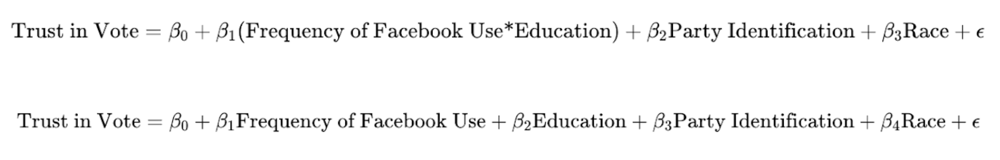
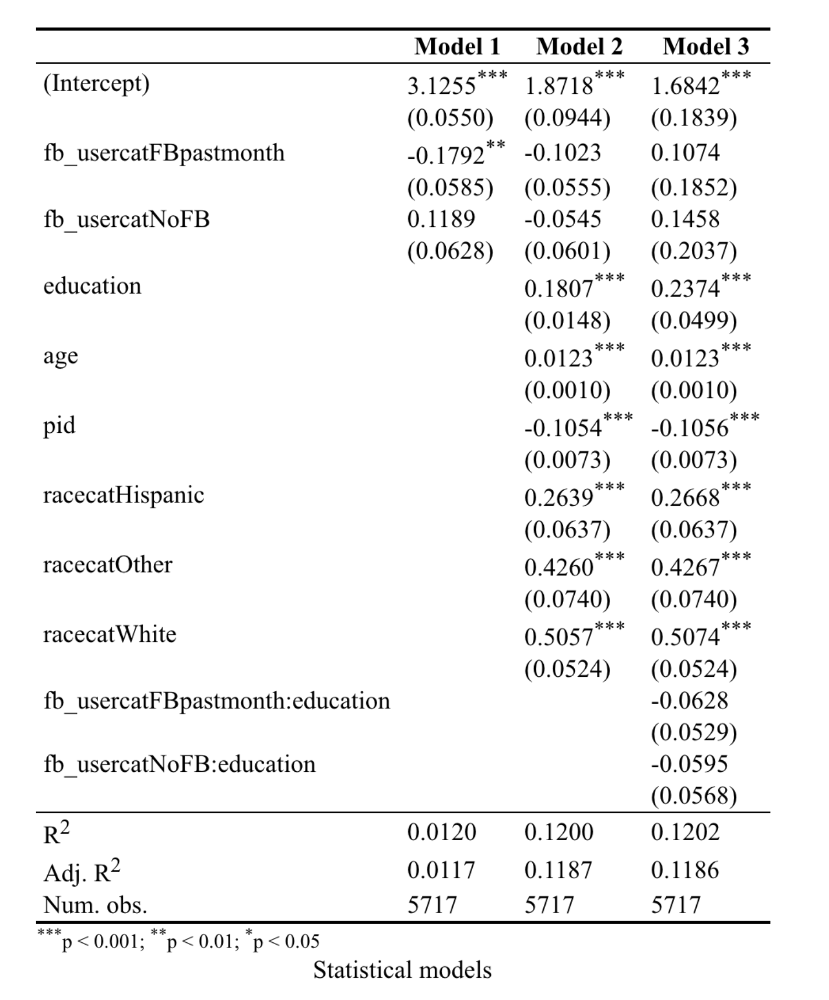
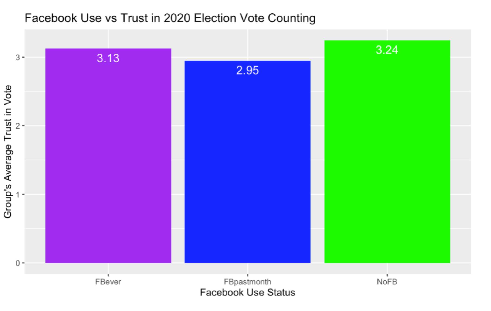
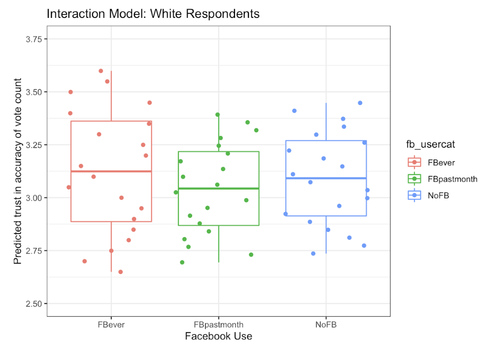
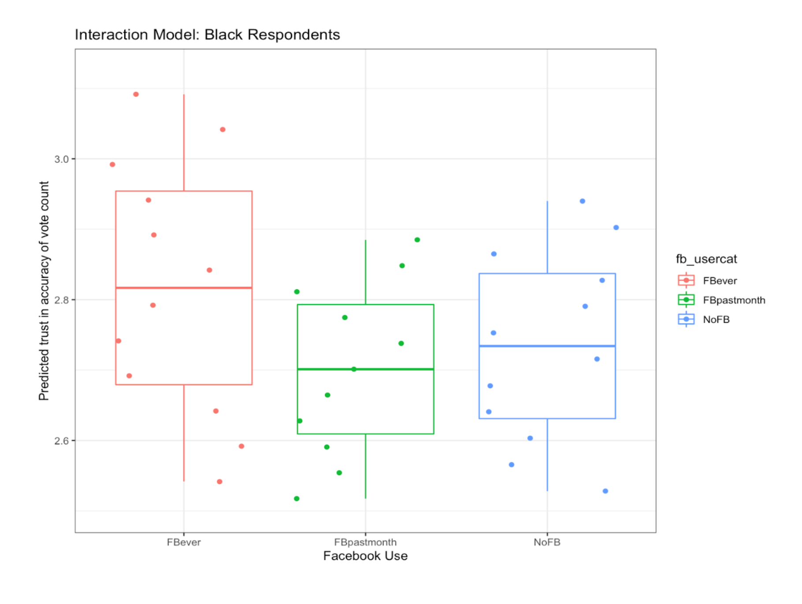

```{r setup, include=FALSE}
options(htmltools.dir.version = FALSE)
knitr::opts_chunk$set(
  warning = FALSE, 
  message = FALSE,
  echo=F,
  comment = NA, 
  dpi = 300,
  fig.align = "center", 
  out.width = "80%", 
  cache = FALSE)

xaringanExtra::use_tile_view()

htmltools::tagList(
  xaringanExtra::use_clipboard(
    button_text = "<i class=\"fa fa-clipboard\"></i>",
    success_text = "<i class=\"fa fa-check\" style=\"color: #90BE6D\"></i>",
  ),
  rmarkdown::html_dependency_font_awesome()
)

# Setup
the_packages <- c(
  ## R Markdown
  "kableExtra","DT","texreg",
  ## Tidyverse
  "tidyverse", "lubridate", "forcats", "haven", "labelled",
  ## Extensions for ggplot
  "ggmap","ggrepel", "ggridges", "ggthemes", "ggpubr", 
  "GGally", "scales", "dagitty", "ggdag", "ggforce",
  # Graphics:
  # Data 
  "COVID19","maps","mapdata","qss","tidycensus", "dataverse", 
  # Analysis
  "DeclareDesign", "zoo"
)

ipak <- function(pkg){
    new.pkg <- pkg[!(pkg %in% installed.packages()[, "Package"])]
    if (length(new.pkg)) 
        install.packages(new.pkg, dependencies = TRUE)
    sapply(pkg, require, character.only = TRUE)
}

ipak(the_packages)
```


class:inverse, middle, center
background-image: url("https://thumbs.gfycat.com/EthicalLinedGnatcatcher-max-1mb.gif")
background-size: contain

---
# Research Question

- Broadly, we are interested in the relationship between politics and social media, particularly in terms of its relationship to and effect on democracy

- We then came up with the following question: How did overall trust in the fairness of the 2020 election vary with Facebook use? 

- In other words: Are Facebook users more or less likely to trust the vote?


---
# Theory 

- Given the recent wave of incidents with Facebook that have shed light on its political practices, we believe the social media platform might undermine democratic norms such as trust in elections and the vote

- We believe this to be the case due to the algorithmic design of Facebook as well as its broader business model… Facebook is known to be divisive and push emotive messages that often contain misinformation

- We want to control and account for factors like age, partisanship, and education — all covariates that could change the way a user interacts with and processes the content they see on social media AND change their likelihood of trusting the vote


---
# Expectations

- Survey respondents who use Facebook more often (i.e. in the past month) are expected to report significantly lower levels of trust that the vote was counted accurately.

- If an inverse relationship is discovered (a positive correlation were found), that would contradict our hypothesis.

- If no significance were determined, then we would not be able to reject the null hypothesis that there is no relationship between Facebook usage and trust in the vote.

---
# Data

- Our data is sourced from the American National Election Survey 2020 Social Media Study.

- The cleaned dataset (removing NA’s) has 5717 observations, and our unit of observation is the individual survey participant.

- We measure our outcome through the “trustvote” variable, which is on a scale from 1-5.

- Our key predictor variable is “fb_usercat”, which has three categories to denote Facebook use: 1 = Used in the past month, 2 = Ever used Facebook, 3 = Never used Facebook 

- Other covariates considered include race, partisan identity, age, and education.


---
# Design

- Our study tests our baseline expectations by analyzing three models: a bivariate model, a multiple regression, and an interaction model.

- Bivariate model:
$$\text{Trust in Vote} = \beta_0 + \beta_1 \text{Frequency of Facebook Use} +  \epsilon$$
The significance of the coefficient for “fb_usercat” determines whether our baseline expectations are proven false or not.

- A positive coefficient for the category “FBPastMonth” would indicate that using Facebook increases trust in the vote, a negative coefficient would indicate decreasing trust in the vote with Facebook use.

- We expect the coefficient for Facebook use to be significant and negative.

---
#Design (continued)

- Some covariates we include in our multiple regression and interaction models are race, age, education, and partisan identity, all of which likely relate to both the variable and the outcome.


```{r}

```


---

```{r}

```


---

```{r}

```

---

```{r}

```

---

```{r}

```

---
# Results: 

- While our bivariate model revealed a statistically significant negative relationship between frequency of facebook use and trust in the vote (confirming our expectations), the R^2 value is too low to be representative of the actual relationship between Facebook use annd trust in the accuracy of vote count

- In the two models that had notably higher R^2 values, Facebook use not only was found to be insignificant, but it also channged sign from the bivariate model

- The most significant predictors for trust in vote count accuracy are education, age, race, and party identification


---
# Conclusion

- Our study sought to investigate and find a causal relationship between Facebook use and faith in democratic principles through analyzing the data collected in the 2020 ANES Social Media Survey.

- Ultimately, we found no significant relationship between our analyzed predictor and the outcome variable

- Limitations
  - ANES observed a highly-educated group
  - Those who already display distrust in democratic norms would likely be difficult to poll in a formal setting
  - Distrust can vary across administrations (i.e., a supporter of the party/ideology in power might be more trustworthy of democratic norms than someone of the opposite party/ideology)

---
# Appendix

- To see our figures and regression models, visit https://sites.google.com/brown.edu/pleasework/home
