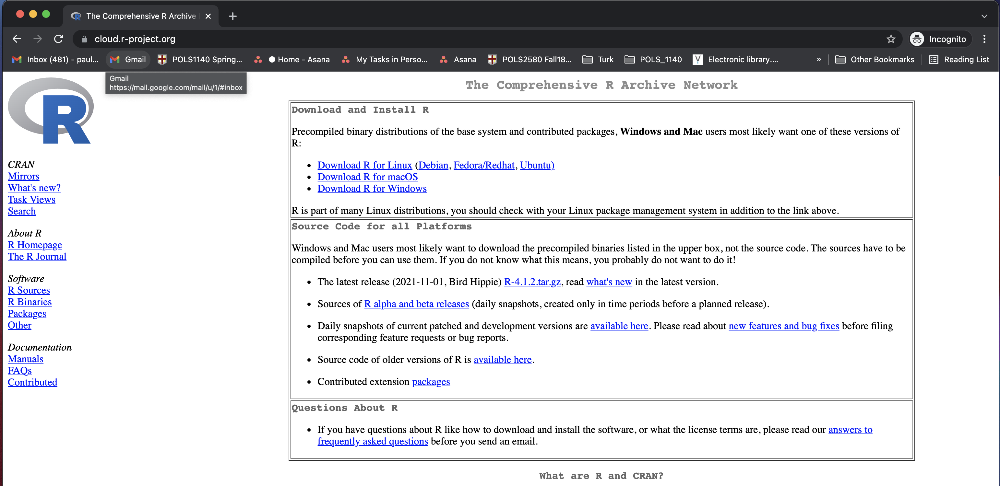
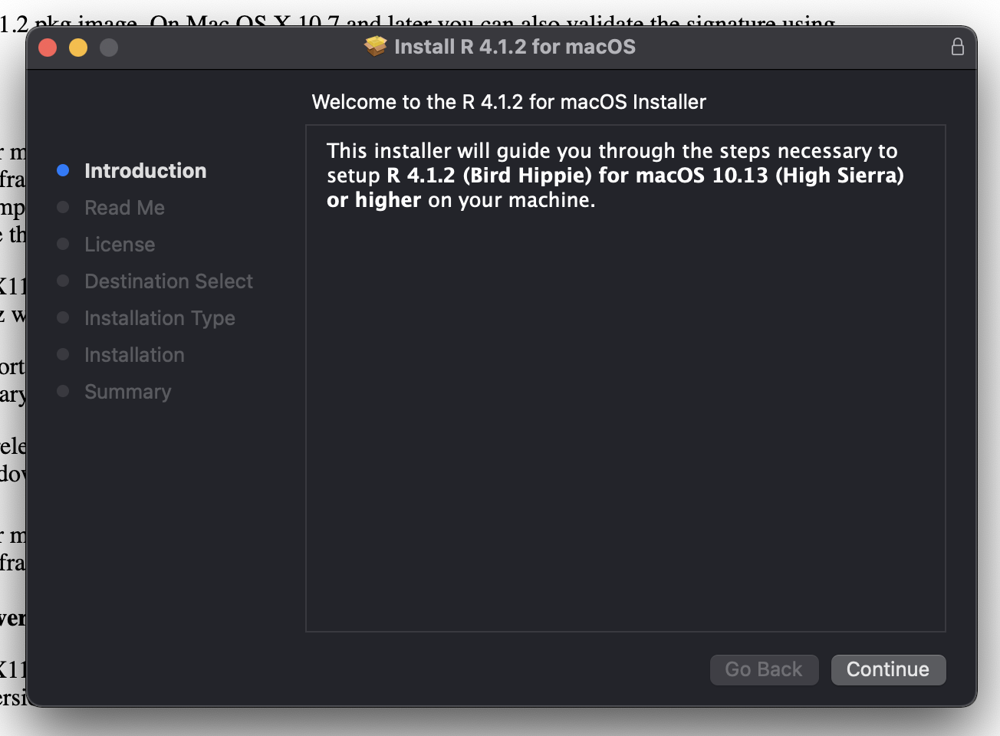
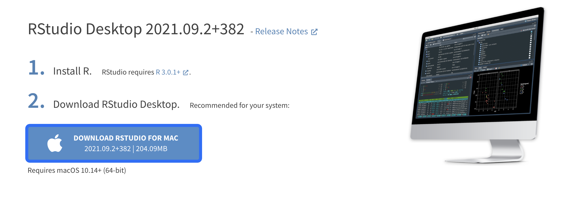
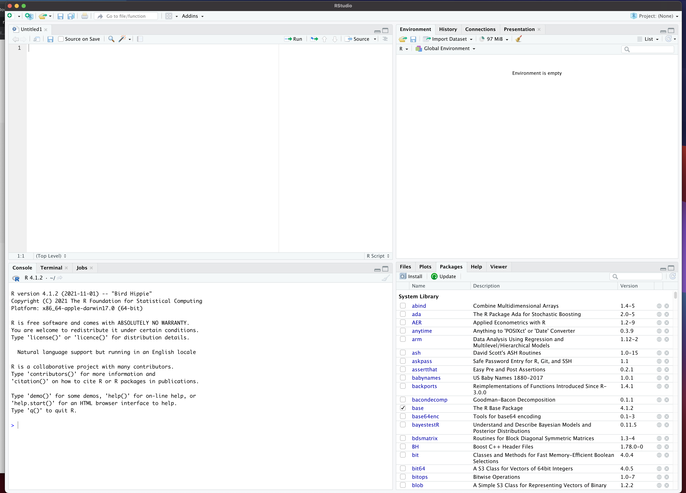

```{r setup, include = FALSE, cache = FALSE}
knitr::opts_chunk$set(error = TRUE, comment = NA, warnings = FALSE, errors = FALSE, messages = FALSE, tidy = FALSE)
```

```{r load-packages, include = FALSE}
library(tidyverse)
library(babynames)
```

> Read all the way through step 6, and note that there is a file that needs to be turned in to Sakai before Wednesday at noon!

# Overview

In this course, we'll learn research methods by actually working with data to conduct empirical analysis. 

To do that we'll use  [R, a free and open-source software environment for statistical computing and graphics.](https://www.r-project.org) the graphical user interface [R Studio](https://www.rstudio.com/). 

Below are some steps to get you set up so that we can get started on Friday:

# If you have a question or somethings not working, don't hesitate to ask.

Please email me at <paul_testa@brown.edu> or come to my office at 111 Thayer St Rm 339.

# Download `R`

- **Download R here:** <https://cran.r-project.org/>
  - Make sure your operating systems are up to date.
    - Mac: at least macOS 10.13 (High Sierra) (Latest:  macOS Monterey 12.1 )
    - PC: It should work on most versions you have installed


- Just click yes, on everything the installer asks




# Download RStudio  

- **Download the desktop version of RStudio here:** <https://www.rstudio.com/products/rstudio/download/>

- Scroll down till you get to something like this



- Make sure to move the RStudio.app into your Applications folder


# Open R Studio

3. **Open R Studio on your machine.** There are four "panes" which correspond roughly to:
    - The top left is where you'll write your code (Source/Text Editor). Will appear once you open a file.
    - The bottom left is where you'll run your code (Console)
    - The top right is a list of what you've done (Workspace/Environment)
    - The bottom right is a collection of things we'll go over in class, things like packages plots (Packages/Files/Plots abd nire)



# Install packages

- **RStudio will likely ask you to install a bunch of packages on start up. Please do so. Get a coffee or check your email**
    - R will now install a bunch of pacakges (programs that do specific things). You only have to do this once. 
    - This may take a while and RStudio may ask you to choose a "mirror" (pick any one in the US). It may also give you an error. Don't worry, email me.

## Install devtools

## Install qss

# Create a RMarkdown Document

5. **Click File > New File > R Markdown**
    - Again, R should as you what kind of file you want to make, choose html (the default) and fill in things like the title or author if you want.

## "Knit" your RMarkdown Document

6. **Click the knit button** in the Source/Text editor on the upper left and see what happens
    - In a perfect world, you'll get a nice pretty looking html document
    - Quite possibly, you'll get some error. That's fine and to be expected when starting up. The goal of having you do this on your own is to try and get to and resolve those barriers as quickly as possible. So don't sweat it too much. We'll take care of things in class on Tuesday
    

If things go as planned, you may want to play around with some of these resources for learning:

 **R:** 

- <http://r4ds.had.co.nz/> R for data science. A great reference for much of what we'll be doing in the course
- <https://cran.r-project.org/doc/manuals/R-intro.pdf> A bit dense
- <http://www.cyclismo.org/tutorial/R/> Nice intro
- <http://swirlstats.com/> Same
- <http://www.burns-stat.com/pages/Tutor/R_inferno.pdf> More programmy

**R Markdown:**

- <http://rmarkdown.rstudio.com/lesson-1.html> Skip to the cheatsheets

**General:**

- <http://www.google.com> Seriously, if you have a problem or error, chances are someone else has. 
- <http://stackoverflow.com/questions/tagged/r> Programming specific
- <http://stats.stackexchange.com/> Stats specific
