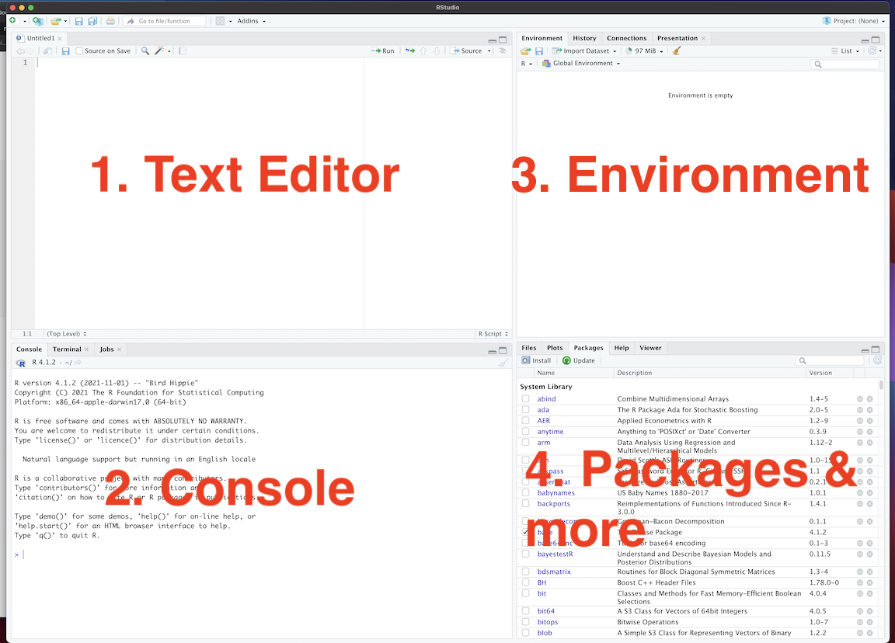

```{r setup, include = FALSE, cache = FALSE}
knitr::opts_chunk$set(error = TRUE, comment = NA, warnings = FALSE, errors = FALSE, messages = FALSE, tidy = FALSE)
```

```{r load-packages, include = FALSE}
library(tidyverse)
library(babynames)
```


# Overview {-}

In this course, we'll learn research methods by actually working with data to conduct empirical analysis. 

To do that we'll use  [R, a free and open-source software environment for statistical computing and graphics.](https://www.r-project.org) the graphical user interface [R Studio](https://www.rstudio.com/). 

Below are some steps to get you set up so that we can get started next class.

## TLRD {-}

If you're pressed for time here's the short version of what you should do before next class.

1. Download [R](https://cran.r-project.org/)
2. Download [R Studio](https://www.rstudio.com/products/rstudio/download/)
3. Open R Studio on your computer
4. Install some packages for the course

Specifically copy and paste the following into the console in R Studio and hit enter:

```{r, eval=F}
install.packages("devtools")
install.packages("remotes")
remotes::install_github("kosukeimai/qss-package", build_vignettes = TRUE)
remotes::install_github("rstudio/learnr")
remotes::install_github("rstudio-education/gradethis")
remotes::install_github("PaulTestaBrown/qsslearnr")
```

5. Create an R Markdown File (.Rmd) in R Studio
  - File > New File > R Markdown
6. Knit this R Markdown File into an html file. 
  - Click the ball of yarn with the needle OR:
  - Use the hot keys: Mac: `cmd + shift + k` PC: `crtl + shift + k` 


  > If you have a question or somethings not working, don't hesitate to ask. Please email me at <paul_testa@brown.edu> or come to my office at 111 Thayer St Rm 339.

# Download `R`

- **Download R here:** <https://cran.r-project.org/>
  - Make sure your operating systems are up to date.
    - Mac: at least macOS 10.13 (High Sierra) (Latest:  macOS Monterey 12.1 )
    - PC: It should work on most versions you have installed


- Just click yes, on everything the installer asks


# Download RStudio  

- **Download the desktop version of RStudio here:** <https://www.rstudio.com/products/rstudio/download/>

- Scroll down till you get to something like this


- If you're on a Mac, make sure to **move the RStudio.app into your Applications** folder


# Open R Studio

- Open your applications folder/start menu and **Open R Studio on your computer.** 
- There are four "panes" in R Studio corresponding to:
    - **Source/Text Editor** in the top left is where you'll write your code. Note: This will probably appear minimized when you first open RStudio
    - **Console** in the bottom left  where you'll run your R code 
    - **Workspace/Environment** in the top right is a list of what you've done
    - **Files/Plots/Packages/Help/Viewer** The bottom right is a collection of panels we'll go over in class. 



# Install packages

- **RStudio will likely ask you to install a bunch of packages on start up. Please do so. Get a coffee or check your email**
    - R will now install a bunch of packages (programs that do specific things). You only have to do this once. 
    - This may take a while and RStudio may ask you to choose a "mirror" (pick any one in the US). It may also give you an error. Don't worry, email me.

## Install the `devtools` and  `remotes` packages

The version of R that you just downloaded is considered base R, which provides you with good but basic statistical computing and graphics powers. 

To get the most out of R, you'll need to install add-on packages, which are user-written to extend/expand your R capabilities. 

Packages can live in one of two places:

* They may be carefully curated by CRAN (which involves a thorough submission and review process), and thus are easy install using `install.packages("name_of_package", dependencies = TRUE)`. 
* Alternatively, they may be available via the software sharing platform GitHub. 

To download these packages, you first need to install the `devtools` and `remotes` packages.

```{r devtools, eval = FALSE}
install.packages("devtools")
install.packages("remotes")
```

Place your cursor in the console (lower left panel), and copy and paste each line of code above. After you've pasted a line, hit `Enter/Return` and R will execute (run) that line of code. So type:

  > install.packages("devtools")
  
Hit enter.

Then type

  > install.packages("remotes") 
  
And hit enter again. 

Each time, R will likely spit out some cryptic <span style="color: red;">red text </span> as installs the packages. 

When it's done, R will you should see a line with a single `>` in the console.

You should be able to see the newly installed packages by scrolling through or searching the `Packages` pane on the bottom left


## Install Packages for Course

Now we'll use the `intall_github()` function from the `remotes` package, to install some packages we'll use for this course.

Again, copy and paste each line of code into your console, and hit `Enter/Return` to run that code.

```{r, eval=F}
remotes::install_github("kosukeimai/qss-package", build_vignettes = TRUE)
remotes::install_github("rstudio/learnr")
remotes::install_github("rstudio-education/gradethis")
remotes::install_github("PaulTestaBrown/qsslearnr")
```

We'll go over this during our next meeting so don't worry if this doesn't work


In particular, we'll be using a version of Matthew Blackwell's [`qsslearnr`](https://github.com/mattblackwell/qsslearnr) as problem sets for this course.

You can see the available problem sets by running the following code in your console:

```{r, eval = F}
learnr::run_tutorial(package = "qsslearnr")
```

And start a tutorial by running:

```{r, eval = F}
learnr::run_tutorial("00-intro", package = "qsslearnr")
```

To try and explain in words what this code is doing:

 - `learnr::run_tutorial(` Says use the `run_tutorial()` from the `learnr` package
 - `"00-intro"` tells `run_tutorial()` to run the `"00-intro"` tutorial
 - `package = "qsslearnr"` tells `run_tutorial()` to look for this tutorial in the `qsslearnr` package.

If you run this code, you should see the following tutorial show up in the upper right panel:


## Optional: Adding a Tutorial Panel

You can also add a "Tutorial" panel to R Studio.

- Click on "Tools > Global Options" 
  - Alternatively you can use the hotkey combination `cmd + ,` on a Mac `cntrl + ,` ... No Shortcut for PC :( 


- Select the `Pain Layout` tab. In the upper right of the four pains, check the box next to `Tutorial`
- You may need to close and re-open R Studio. When you do, in the upper right tab you should see:


## Optional: Adjusting R Markdown Display Options

This is just personal perference, but while we're changin some global options, I'd recommend

1. Click on `RMarkdown
2. Set "Show In Document Outline" to `All Sections and Chunks
3. Uncheck the box that says "Show Output in line for all R Markdown Documents"


## Optional: Don't Save R History 

Finally, in the `R General` tab, I'd strongly recommend unchecking the box that says "Always save R History"


** Be sure to click OK** when you're done updating these settings.


# Create Your First R Markdown Document


- Finally, create a R Markdown document (.Rmd) by clicking **Click File > New File > R Markdown**

R Markdown is a file format that allows us to combine `R` code -- which we use to do our statistical analysis -- with [Markdown](https://www.markdownguide.org/) -- a lightweight markup language that can turn plain text into all sorts of formats (.pdf, .doc, .html)

We will do all of our work using .Rmd files so it's good to get some practice. Also, the first time you create a file, R Studio typically has to install some stuff that can take a long time.


- You can also do this by clicking on the new file icon `r icons::fontawesome("file", style = "regular")` in the upper left


- R should ask you what kind of file you want to make, choose html (the default) and fill in things like the title or author if you want.


# "Knit" your R Markdown Document to create HTML file

-**Click the knit button** in the Source/Text editor on the upper left and see what happens


- In a perfect world, you'll get a nice pretty looking html document


On you're machine, R turned your `FILENAME.Rmd` (I named mine `Test.Rmd`) into `FILNENAME.html`. 


Under the hood, it ran some software that ran your R code (stuff in the grey) and combined it with the markdown text (stuff in the white), to produce the final html file. If you click on that file, it will open in your web browser


# Summary {-}

This guide has tried to help you get the software we'll be using for this course set up. If everything's gone as planned, you should have:

1. Downloaded R
2. Downloaded R Studio
3. Installed some packages
4. Maybe changed some options in R Studio
5. Created and compiled your first document using R Markdown

Bravo! Seriously, this stuff isn't easy, and I really appreciate the time you put in. It will make our subsequent classes more smoothly.

Of course, everything rarely goes as planned. If you got an error or things don't work out. Don't worry. This literally always happens for a multitude of reasons. I promise we'll take care of things in our next class.


##Additional References {-}
 

If you simply can't wait to get started, you might explore some of the following

 **R:** 

- <http://r4ds.had.co.nz/> R for data science. A great reference for much of what we'll be doing in the course
- <https://cran.r-project.org/doc/manuals/R-intro.pdf> A bit dense
- <http://www.cyclismo.org/tutorial/R/> Nice intro
- <http://swirlstats.com/> Same
- <http://www.burns-stat.com/pages/Tutor/R_inferno.pdf> More programmy

**R Markdown:**

- <http://rmarkdown.rstudio.com/lesson-1.html> Skip to the cheatsheets

**General:**

- <http://www.google.com> Seriously, if you have a problem or error, chances are someone else has. 
- <http://stackoverflow.com/questions/tagged/r> Programming specific
- <http://stats.stackexchange.com/> Stats specific
