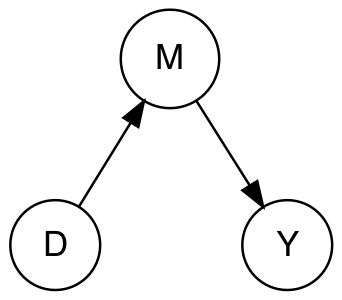
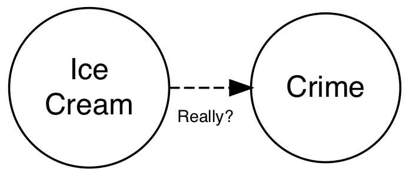
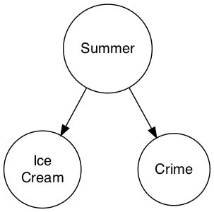
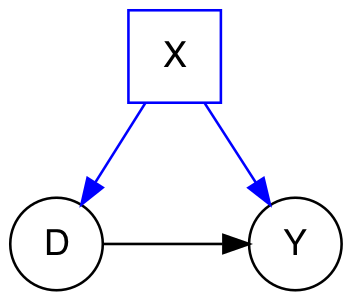
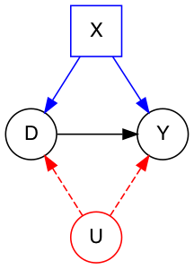
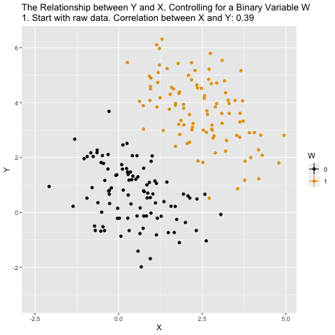
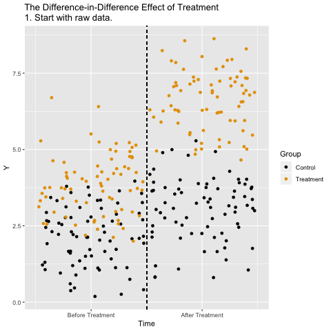
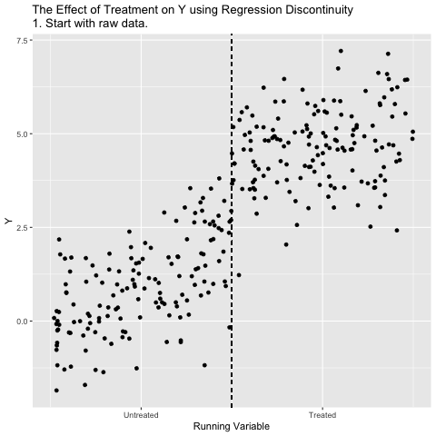
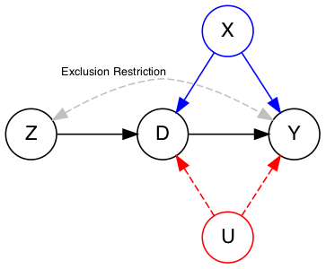

```{r setup, echo=F,message=F,warning=F}
if (!require("pacman")){ install.packages("pacman") }
pacman::p_load("knitr","tidyverse","kableExtra","stringi","stringr",
               "reshape2","haven","readxl","janitor",
               "kableExtra","ggpubr",
               "gganimate","ggthemes",
               "gifski"
               )

# Set global options for knitting
# Turn on caching to speed up knitting
opts_chunk$set(eval=T,echo=T,message=F,warning=F,cache=T)

```

# Overview

We'll begin by reviewing concepts and labs from last week.

Then we'll start talking about strategies for making causal claims in observational studies.

- Not everything we want to make causal claims about is amenable to random assignments
- But, the conditions created by an experiment provide a benchmark to assess the credibility of a study's causal claims
- All observational studies that make causal claims are make some assumption that the thing they're interested is as-if randomly assigned
- Specific features of a study's  design make this assumption more or less credible.
    - Natural experiment: Nature randomized the thing I care about (think of lotteries to get into select schools) or created some *exogenous* source of variation
    - A kitchen sink regression: I've *controlled* for all the relevant factors that matter. How do I know? Because I said so.

After today, you should be able to explain:

- The basic intuition behind the concept of conditional ignorability
- Have a sense of what it means to control for some variable
- Understand the idea of confounding variables
- Develop a familiarity with the following tools for making casual claims with observational data:
  - Regression
  - Difference-in-difference
  - Regression discontinuity
  - Instrumental variables


# Review  
  
## Conceptual review

The key conceptual points from last week are:

- Causation involves making claims about counterfactuals
- The fundamental problem of causal inference (FPoCI) is that for any individual, we can only see one of potentially many possible outcomes
- Randomization is the key to estimating average causal effects. 
- In experiments, researchers intervene on the world by randomly assigning subjects to treatment and control
- Random assignment addresses concerns about selection bias
- It creates two groups that on average, are as similar as possible but for the thing who's causal effect we wish to know.


## Lab Review

- We'll review the results in `02_lab_2_comments.Rmd`


## Interval vs External Validity##

- Experiments have high internal validity
    - Are study provides a valid (unbiased) estimate of the thing we're trying to learn
    - External validity is a more mushy concept
        - Generalizability
        - Ecological validity
    - Field experiments are thought to be more "externally valid" than lab or survey experiments
- In any study, we can think about relative tradeoffs between internal and external validity

## Credible Designs

- In this class, we will evaluate the credibility of studies by the features of their design
- What makes B&K credible?
    - Randomization with a placebo control
    - Multiple measures and periods of analysis
    - Second intervention
- What makes B&K less credible?
    - Measurement (Attitudes vs Behavior)
    - Attrition
    - Questions about time, place, context, that may limit the generalizability of their results
- What's a meaningful difference?
    - What's a confidence interval?


# Causal Inference in Observational Studies

## Observational versus experimental studies

- In an *observational study* the researcher does not control the treatment assignment
- No guarantee that treatment (D=1) and control groups (D=0) are comparable (That is that we're comparing like with like)
- Instead, we have justify our claims by theory and assumption rather than direct manipulation


## (P)Review: Conditional ignorability

If treatment is not randomly assigned then:

\[
Y_i(1),Y_i(0) \text{ is not} \perp D_i
\]


However, in some situations, it may be plausible to claim that *conditional* on some variable(s) $X$, the distribution of potential outcomes $Y$ is the same (independent) across levels of treatment $D$ (**conditional ignorability**)


\[
Y_i(1),Y_i(0) \perp D_i |X_i
\]

- Conditional on a some covariate(s) $X_i$ our treatment is as-if randomized

## As-if randomized


- The claim that treatment is as-if randomized requires further justification in the theory and design of your study

\[
Y_i(1),Y_i(0) \perp D_i |X_i
\]

- While we can't "prove" this assumption, we typically can test some observable implications of this claim, specifically, things like covariate balance

## Covariate balance

Recall that true randomization implies ignorability/independence between treatment and potential outcomes

\[
Y_i(1),Y_i(0) \perp D_i
\]

Such that not only does

\[
E[Y(1)|D=1]=E[Y(1)]=E(Y(1)|D=0)
\]

But also


\[
E[X_i|D=1]=E[X_i]=E(X_i|D=0)
\]

In words, the distribution of pre-treatment (why?) covariates (both observed and unobserved) should be similar across treatment and control groups.


While we can't prove our assumption of as-if randomization :

\[
Y_i(1),Y_i(0) \perp D_i |X
\]

We can test its observable implications. 

Suppose we were interested in the effects of some job training program on future earnings (Y). Suppose younger people are more likely to have completed this program than older people. 

Just looking at outcomes between participants and non-participants, would conflate the effects of the program with the effects of age (and the things correlated with age like education). 

So we might expect that levels of education between these groups would vary.

\[
E[Education|D=1]\neq E(Education|D=0)
\]

But if age was the only thing that distinguished participants from non-participants, then $Y_i(1),Y_i(0) \perp D_i |X$, we could estimate a conditional average treatment effect

\[
CATE= E[Y|D=1,Age]-E(Y|D=0,Age)
\]

Further, to test our assumption that conditional on age, job-training recipients are the same as non-job training recipients, would could look at the conditional distributions of other covariates, like education. If our assumption holds, we would expect that

\[
E[Education|D=1,Age] = E(Education|D=0,Age)
\]

Or that the difference between these means is small enough that it's plausible to have arisen just by chance, making our claim that $Y_i(1),Y_i(0) \perp D_i |X$ is more credible. 

We'd hope this type of equality 

\[
E[Education|D=1,Age]=E(Education|D=0,Age)
\]

Were true for all covariates. We can test it for observed covariates (things we call $X$), but may still worry about unobserved covariates (things we call $U$) like innate ability

\[
E[Ability|D=1,Age]\neq E(Ability|D=0,Age)
\]

## Great, but how do we do this R

You already have, combining the mean() function with logical indexes

```{r}
# Load data from last lab
load("fulldata.rda")
# Subset data
df <- df[!is.na(df$treatment_group), ]

# Uncondition mean
mean(df$therm_trans_t1,na.rm=T)

# Conditional mean for those who received the intervetnion
# E(therm_trans_t1 |treatment_group = "Trans Equality")
mean(df$therm_trans_t1[df$treatment_group == "Trans-Equality"],na.rm=T)


# Conditional means by treatment and age
# E(therm_trans_t1 |treatment_group = "Trans Equality" age > 30)

# Olds
mean(df$therm_trans_t1[df$treatment_group == "Trans-Equality" & df$vf_age > 30],na.rm=T)
mean(df$therm_trans_t1[df$treatment_group == "Recycling" & df$vf_age > 30],na.rm=T)

# Youths
mean(df$therm_trans_t1[df$treatment_group == "Trans-Equality" & df$vf_age <= 30],na.rm=T)
mean(df$therm_trans_t1[df$treatment_group == "Recycling" & df$vf_age <= 30],na.rm=T)


```


# Conditioning and stastical control in observational studies


# Directed Acyclic Graphs

Directed acyclic graphs are way of representing the causal relationships between variables

- Paths: A route that connects variables  (D to X to Y)
- Causal if arrows all point in same direction
- "The effect of D on Y is entirely mediated by M"



Let's consider a simple example examining the relationship between ice cream sales and crime

## Common Causes: Ice cream and crime

- When ice cream sales go up so does crime
- We all know sherbet is terrible, but does ice cream really cause crime?
 




- Probably not. Both crime and ice cream sales have a **common cause:** Summer (hotter weather, more people outside, the mechanism's murky)
- In general, two variables with a common cause will have a marginal relationship: $Pr[Y=y|D=1]\neq Pr[Y=y|D=0]$
- Correlation $\neq$ Causation




## Confounding Relationships

- If X is a common cause of D and Y, often called a confounding variable because the true causal effect of D on Y is confounded by each variable's relationship with X.
- What do we do?


- If we can **condition** on X, we can identify the effect of D on Y



- Great! So how do we condition on variables?
- One approach is to hold the variable we want to condition on (X) constant at some value (c) or ranges of values and look at relationships where (e.g. E(Y|D=1, X=c)-E(Y|D=0,X=c))
    - Only look at the relationship between ice cream sales and crime on days with the same temperature
    - In our lab, only look at villages within some distance of the border.
- As we'll discuss next class, this process of **subclassification** has some drawbacks and so we'll discuss alternative strategies and approaches.


## Conditioning on covariates

The GQ approach


## Subclassification

- Our goal is to approximate the experimental ideal of covariate balance so that we're comparing like with like.
- One approach is to subset the data by groups (or strata) and then look at the relationship between D and Y within groups (e.g. E(Y|D=1,X=x))
- Pros:
    - Conceptually simple
- Cons:
    - What if your variable is continuous?
    - What if you have lots of potential confounders?

## Covariate adjustment

- Parametric/model-based approaches
    - Regression
- Pros: Easy to implement and interpret
- Cons: Assumes you have the correct statistical model...
- Semi/less parametric approaches
    - Matching
        - Exact (similar)
        - Coarsened ("bin" the data)
        - Propensity score (summarize the data with a propensity score model)
        - Distanced-based approaches (summarize the data using a distance measure)
- Pros: More flexible
- Cons: Model dependent, only guarantees balance on observed covariates


## Observed and unobserved confounders

What do me mean when we say something is model dependent?

- Here we've conditioned on X, but have no guarantee that some lurking $U$ might also confound our estimates




# Strategies for making causal claims in observational studies

## A Typology of Observational Studies

- Cross-sectional
- Longitudinal
- Natural Experiments

## Cross-sectional

- Observational data at single point in time (cross-section)
- Methods: regression, matching
- Concerns: Selection on observables, omitted variable bias

### Conditioning on (Controlling for) a Variable

```{r control, eval=F, echo=F, message=F,warning=F}
df <- data.frame(W = as.integer((1:200>100))) %>%
  mutate(X = .5+2*W + rnorm(200)) %>%
  mutate(Y = -.5*X + 4*W + 1 + rnorm(200),time="1") %>%
  group_by(W) %>%
  mutate(mean_X=mean(X),mean_Y=mean(Y)) %>%
  ungroup()

#Calculate correlations
before_cor <- paste("1. Start with raw data. Correlation between X and Y: ",round(cor(df$X,df$Y),3),sep='')
after_cor <- paste("6. Analyze what's left! Correlation between X and Y controlling for W: ",round(cor(df$X-df$mean_X,df$Y-df$mean_Y),3),sep='')


#Add step 2 in which X is demeaned, and 3 in which both X and Y are, and 4 which just changes label
dffull <- rbind(
  #Step 1: Raw data only
  df %>% mutate(mean_X=NA,mean_Y=NA,time=before_cor),
  #Step 2: Add x-lines
  df %>% mutate(mean_Y=NA,time='2. Figure out what differences in X are explained by W'),
  #Step 3: X de-meaned 
  df %>% mutate(X = X - mean_X,mean_X=0,mean_Y=NA,time="3. Remove differences in X explained by W"),
  #Step 4: Remove X lines, add Y
  df %>% mutate(X = X - mean_X,mean_X=NA,time="4. Figure out what differences in Y are explained by W"),
  #Step 5: Y de-meaned
  df %>% mutate(X = X - mean_X,Y = Y - mean_Y,mean_X=NA,mean_Y=0,time="5. Remove differences in Y explained by W"),
  #Step 6: Raw demeaned data only
  df %>% mutate(X = X - mean_X,Y = Y - mean_Y,mean_X=NA,mean_Y=NA,time=after_cor))

p <- ggplot(dffull,aes(y=Y,x=X,color=as.factor(W)))+geom_point()+
  geom_vline(aes(xintercept=mean_X,color=as.factor(W)))+
  geom_hline(aes(yintercept=mean_Y,color=as.factor(W)))+
  guides(color=guide_legend(title="W"))+
  scale_color_colorblind()+
  labs(title = 'The Relationship between Y and X, Controlling for a Binary Variable W \n{next_state}')+
  transition_states(time,transition_length=c(12,32,12,32,12,12),state_length=c(160,100,75,100,75,160),wrap=FALSE)+
  ease_aes('sine-in-out')+
  exit_fade()+enter_fade()

animate(p,nframes=200)
anim_save("00_figures/control.gif")
```



## Longitudinal

- Observational data over multiple points in time 
- Methods: fancy regression models (fixed and random effects, VAR, ...), Difference-in-Difference designs
- Concerns: Possible to control for time invariant covariates, but what about unobserved, time-varying covariates? 

### Difference in Difference Designs

```{r did, eval=F,echo=F,message=F,warning=F}
df <- data.frame(Control = c(rep("Control",150),rep("Treatment",150)),
                 Time=rep(c(rep("Before",75),rep("After",75)),2)) %>%
  mutate(Y = 2+2*(Control=="Treatment")+1*(Time=="After") + 1.5*(Control=="Treatment")*(Time=="After")+rnorm(300),state="1",
         xaxisTime = (Time == "Before") + 2*(Time == "After") + (runif(300)-.5)*.95) %>%
  group_by(Control,Time) %>%
  mutate(mean_Y=mean(Y)) %>%
  ungroup()

df$Time <- factor(df$Time,levels=c("Before","After"))

#Create segments
dfseg <- df %>%
  group_by(Control,Time) %>%
  summarize(mean_Y = mean(mean_Y)) %>%
  ungroup()

diff <- filter(dfseg,Time=='After',Control=='Control')$mean_Y[1] - filter(dfseg,Time=='Before',Control=='Control')$mean_Y[1]

dffull <- rbind(
  #Step 1: Raw data only
  df %>% mutate(state='1. Start with raw data.'),
  #Step 2: Add Y-lines
  df %>% mutate(state='2. Figure out what differences in Y are explained by Treatment and/or Time.'),
  #Step 3: Collapse to means
  df %>% mutate(Y = mean_Y,state="3. Keep only what's explained by Treatment and/or Time."),
  #Step 4: Display time effect
  df %>% mutate(Y = mean_Y,state="4. See how Control changed over Time."),
  #Step 5: Shift to remove time effect
  df %>% mutate(Y = mean_Y 
                - (Time=='After')*diff,
                state="5. Remove the Before/After Control difference for both groups."),
  #Step 6: Raw demeaned data only
  df %>% mutate(Y = mean_Y 
                - (Time=='After')*diff,
                state='6. The remaining Before/After Treatment difference is the effect.'))


p_did <- ggplot(dffull,aes(y=Y,x=xaxisTime,color=as.factor(Control)))+geom_point()+
  guides(color=guide_legend(title="Group"))+
  geom_vline(aes(xintercept=1.5),linetype='dashed')+
  scale_color_colorblind()+
  scale_x_continuous(
    breaks = c(1, 2),
    label = c("Before Treatment", "After Treatment")
  )+xlab("Time")+
  #The four lines for the four means
  geom_segment(aes(x=ifelse(state %in% c('2. Figure out what differences in Y are explained by Treatment and/or Time.',"3. Keep only what's explained by Treatment and/or Time."),
                            .5,NA),
                   xend=1.5,y=filter(dfseg,Time=='Before',Control=='Control')$mean_Y[1],
                   yend=filter(dfseg,Time=='Before',Control=='Control')$mean_Y[1]),size=1,color='black')+
  geom_segment(aes(x=ifelse(state %in% c('2. Figure out what differences in Y are explained by Treatment and/or Time.',"3. Keep only what's explained by Treatment and/or Time."),
                            .5,NA),
                   xend=1.5,y=filter(dfseg,Time=='Before',Control=='Treatment')$mean_Y[1],
                   yend=filter(dfseg,Time=='Before',Control=='Treatment')$mean_Y[1]),size=1,color="#E69F00")+
  geom_segment(aes(x=ifelse(state %in% c('2. Figure out what differences in Y are explained by Treatment and/or Time.',"3. Keep only what's explained by Treatment and/or Time."),
                            1.5,NA),
                   xend=2.5,y=filter(dfseg,Time=='After',Control=='Control')$mean_Y[1],
                   yend=filter(dfseg,Time=='After',Control=='Control')$mean_Y[1]),size=1,color='black')+
  geom_segment(aes(x=ifelse(state %in% c('2. Figure out what differences in Y are explained by Treatment and/or Time.',"3. Keep only what's explained by Treatment and/or Time."),
                            1.5,NA),
                   xend=2.5,y=filter(dfseg,Time=='After',Control=='Treatment')$mean_Y[1],
                   yend=filter(dfseg,Time=='After',Control=='Treatment')$mean_Y[1]),size=1,color="#E69F00")+
  #Line indicating treatment effect
  geom_segment(aes(x=1.5,xend=1.5,
                   y=ifelse(state=='6. The remaining Before/After Treatment difference is the effect.',
                            filter(dfseg,Time=='After',Control=='Treatment')$mean_Y[1]-diff,NA),
                   yend=filter(dfseg,Time=='Before',Control=='Treatment')$mean_Y[1]),size=1.5,color='blue')+
  #Line indicating pre/post control difference
  geom_segment(aes(x=1.5,xend=1.5,
                   y=ifelse(state=="4. See how Control changed over Time.",
                            filter(dfseg,Time=='After',Control=='Control')$mean_Y[1],
                            ifelse(state=="5. Remove the Before/After Control difference for both groups.",
                                   filter(dfseg,Time=='Before',Control=='Control')$mean_Y[1],NA)),
                   yend=filter(dfseg,Time=='Before',Control=='Control')$mean_Y[1]),size=1.5,color='blue')+
  labs(title = 'The Difference-in-Difference Effect of Treatment \n{next_state}')+
  transition_states(state,transition_length=c(6,16,6,16,6,6),state_length=c(50,22,12,22,12,50),wrap=FALSE)+
  ease_aes('sine-in-out')+
  exit_fade()+enter_fade()

animate(p_did,nframes=150)
anim_save("00_figures/did.gif")
```



## True natural experiments

- Nature cooperates to create situation in which treatment is randomly assigned
- Methods: Regression, non-parametric estimators
- Concerns: Nature is rarely so kind; Researcher doesn't control assignment so are we sure it's really random?


## Discontinuities

- Nature creates some discontinuity (like the line between Occupied and Vichy France), such that observations close to that discontinuity are plausibly similar, except for the fact that one group receives treatment and the other does not
- Concerns: Estimating a "local" ATE (i.e. true for cases close to the discontinuity); Is local as-if randomization a reasonable assumption?

```{r rdd, eval=F, echo=F,warning=F,message=F}
df <- data.frame(xaxisTime=runif(300)*20) %>%
  mutate(Y = .2*xaxisTime+3*(xaxisTime>10)-.1*xaxisTime*(xaxisTime>10)+rnorm(300),
         state="1",
         groupX=floor(xaxisTime)+.5,
         groupLine=floor(xaxisTime),
         cutLine=rep(c(9,11),150)) %>%
  group_by(groupX) %>%
  mutate(mean_Y=mean(Y)) %>%
  ungroup() %>%
  arrange(groupX)


dffull <- rbind(
  #Step 1: Raw data only
  df %>% mutate(groupLine=NA,cutLine=NA,mean_Y=NA,state='1. Start with raw data.'),
  #Step 2: Add Y-lines
  df %>% mutate(cutLine=NA,state='2. Figure out what differences in Y are explained by the Running Variable.'),
  #Step 3: Collapse to means
  df %>% mutate(Y = mean_Y,state="3. Keep only what's explained by the Running Variable."),
  #Step 4: Zoom in on just the cutoff
  df %>% mutate(mean_Y = ifelse(xaxisTime > 9 & xaxisTime < 11,mean_Y,NA),Y=ifelse(xaxisTime > 9 & xaxisTime < 11,mean_Y,NA),groupLine=NA,state="4. Focus just on what happens around the cutoff."),
  #Step 5: Show the effect
  df %>% mutate(mean_Y = ifelse(xaxisTime > 9 & xaxisTime < 11,mean_Y,NA),Y=ifelse(xaxisTime > 9 & xaxisTime < 11,mean_Y,NA),groupLine=NA,state="5. The jump at the cutoff is the effect of treatment."))


p_rdd <- ggplot(dffull,aes(y=Y,x=xaxisTime))+geom_point()+
  geom_vline(aes(xintercept=10),linetype='dashed')+
  geom_point(aes(y=mean_Y,x=groupX),color="red",size=2)+
  geom_vline(aes(xintercept=groupLine))+
  geom_vline(aes(xintercept=cutLine))+
  geom_segment(aes(x=10,xend=10,
                   y=ifelse(state=='5. The jump at the cutoff is the effect of treatment.',
                            filter(df,groupLine==9)$mean_Y[1],NA),
                   yend=filter(df,groupLine==10)$mean_Y[1]),size=1.5,color='blue')+
  scale_color_colorblind()+
  scale_x_continuous(
    breaks = c(5, 15),
    label = c("Untreated", "Treated")
  )+xlab("Running Variable")+
  labs(title = 'The Effect of Treatment on Y using Regression Discontinuity \n{next_state}')+
  transition_states(state,transition_length=c(6,16,6,16,6),state_length=c(50,22,12,22,50),wrap=FALSE)+
  ease_aes('sine-in-out')+
  exit_fade()+enter_fade()

animate(p_rdd,nframes=175)
anim_save("00_figures/rdd.gif")
```



## Instrumental Variables

- Z is potential instrument for the effect of D on Y
- Exclusion restriction: No common cause between Z and Y; Only path from Z to Y is through D
- Very hard to find "good" instruments



```{r iv, eval=F, echo = F}
df <- data.frame(Z = as.integer(1:200>100),
                 W = rnorm(200)) %>%
  mutate(X = .5+2*W +2*Z+ rnorm(200)) %>%
  mutate(Y = -X + 4*W + 1 + rnorm(200),time="1") %>%
  group_by(Z) %>%
  mutate(mean_X=mean(X),mean_Y=mean(Y),YL=NA,XL=NA) %>%
  ungroup()

#Calculate correlations
before_cor <- paste("1. Start with raw data. Correlation between X and Y: ",round(cor(df$X,df$Y),3),sep='')
afterlab <- '6. Draw a line between the points. The slope is the effect of X on Y.'

dffull <- rbind(
  #Step 1: Raw data only
  df %>% mutate(mean_X=NA,mean_Y=NA,time=before_cor),
  #Step 2: Add x-lines
  df %>% mutate(mean_Y=NA,time='2. Figure out what differences in X are explained by Z'),
  #Step 3: X de-meaned 
  df %>% mutate(X = mean_X,mean_Y=NA,time="3. Remove everything in X not explained by Z"),
  #Step 4: Remove X lines, add Y
  df %>% mutate(X = mean_X,mean_X=NA,time="4. Figure out what differences in Y are explained by Z"),
  #Step 5: Y de-meaned
  df %>% mutate(X = mean_X,Y = mean_Y,mean_X=NA,time="5. Remove everything in Y not explained by Z"),
  #Step 6: Raw demeaned data only
  df %>% mutate(X =  mean_X,Y =mean_Y,mean_X=NA,mean_Y=NA,YL=mean_Y,XL=mean_X,time=afterlab))

#Get line segments
endpts <- df %>%
  group_by(Z) %>%
  summarize(mean_X=mean(mean_X),mean_Y=mean(mean_Y))

p_iv <- ggplot(dffull,aes(y=Y,x=X,color=as.factor(Z)))+geom_point()+
  geom_vline(aes(xintercept=mean_X,color=as.factor(Z)))+
  geom_hline(aes(yintercept=mean_Y,color=as.factor(Z)))+
  guides(color=guide_legend(title="Z"))+
  geom_segment(aes(x=ifelse(time==afterlab,endpts$mean_X[1],NA),
                   y=endpts$mean_Y[1],xend=endpts$mean_X[2],
                   yend=endpts$mean_Y[2]),size=1,color='blue')+
  scale_color_colorblind()+
  labs(title = 'The Relationship between Y and X, With Binary Z as an Instrumental Variable \n{next_state}')+
  transition_states(time,transition_length=c(6,16,6,16,6,6),state_length=c(50,22,12,22,12,50),wrap=FALSE)+
  ease_aes('sine-in-out')+
  exit_fade()+enter_fade()

animate(p_iv,nframes=175)
anim_save("00_figures/iv.gif")
```


