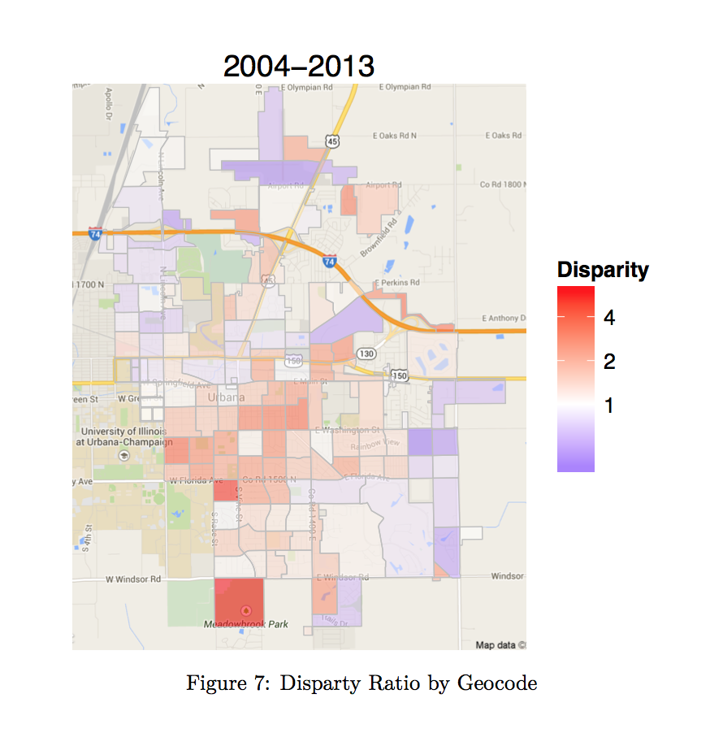
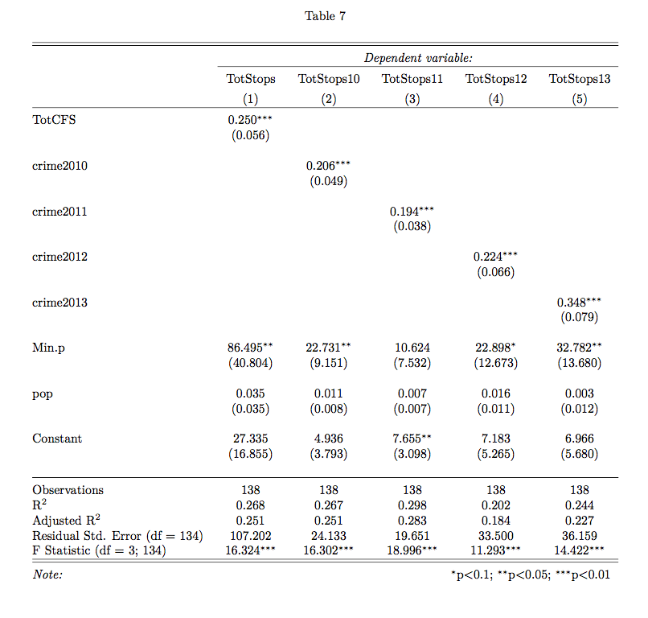

```{r setup, include=FALSE}
options(htmltools.dir.version = FALSE)
knitr::opts_chunk$set(warning = FALSE, message = FALSE, 
  comment = NA, dpi = 300,
  fig.align = "center", out.width = "80%", cache = FALSE)
library(tidyverse)
library(babynames)
```


## Overview

--

- Goals and Expectations

--

- Course Structure

--

- Course Policies

--

- A Few Fundamental Truths


---
class: middle, center

## Goals and Expectations

---

## What you will learn

You will learn 

--

- how to think like a social scientist

--

--

- how to use data to make descriptive, predictive, and causal claims

--

--

- how to quantify uncertainty about these claims

--

--

- how to present, interpret, and critique these claims

---
## Reasons to take this class


--
1. Empirical Data > \#AlternativeFacts 

--

--
2. You want to do your own research 

--

--
3. You want to get a job / go to grad school

--

--
4. You *have* to 

--

--
5. For the memes

--

---
background-image: url("images/00_distracted.jpg")
background-size: contain


---
class: inverse
background-image: url("https://res.cloudinary.com/uktv/image/upload/v1426611188/ekyiync2zbmgdydizkok.jpg")
background-size: cover
background-position: 50% 0%


## Great expectations

Come willing to engage with:

--
- social science

--
--

- data 

--
--


- programming

--
--


- math


---

## Requirements

I assume that you will

1. Do the readings
2. Bring your computers<sup>1</sup>
3. Work through classwork
4. Ask questions

.footnote[
[1] If you only have a desktop/or tablet let me know and we'll figure out a solution.
]

---
class: center, middle

##  Course structure

---

## Class

- Tuesday: Lecture/Demonstration
- Thursday: Lab/Exploration

---

## Class websites

- Notes, slides, and labs available here: [pols1600.paultesta.org](https://pols1600.paultesta.org)
- Assignments uploaded here: [Canvas](https://canvas.brown.edu/courses/1087979)

---

## Software and computing

- Statistics done using R
	  + Open source (free) statistical language
- Through R Studio 
	  * An integrated development environment for R 
- Results written up using R Markdown
	  + Language for combing R code with html Markdown

---

## R


---
## R Studio


---
## R Markdown

- Code in chunks:
	
    ```{r simulate_data}
    x <- rnorm(100)
    y <- 2*x + rnorm(100)
    ```
    
- Write up in [Markdown](https://www.markdownguide.org/)


---
## Textbook


<http://qss.princeton.press/>

---

## How to Read Imai

- Active reading
- Copy and run the code in the text. To do so, do the following:

```{r}
if (!require("devtools")){
  install.packages("devtools")
  }
library("devtools")
install_github("kosukeimai/qss-package",  
               build_vignettes  =  TRUE)
```

---
## How to Read Imai

Anywhere the text loads data:

```{r, eval=F}
afghan <- read.csv("afgahn.csv")
```

You can do 
```{r}
library("qss")
data("afghan")
summary(afghan$age)
```

---
## Additional Readings

- Occasionally, I will provide additional readings, available on both Canvas and pols1600.paultesta.org


---

# Assignments


---
## Assignments

You have three types of assignments in this course


- Labs
- Problem sets
- Final Project


---
## Labs

- Each Thursday we will work in groups to complete an in-class lab
- The labs are designed to reinforce and extend concepts from lecture using real world data.

---
## Labs


---
## Labs


---
## Labs


---
## Labs

- Each month, starting next week, assigned to group of 3. 
	- At least one of you has to bring a laptop class
- Log on to the Canvas, download the classwork
- Open R Studio
- All files submitted as .Rmd or .htmls by the end of class
- No late work
- One question randomly graded
	  + 100% if correct
	  + 85% if incorrect, but you tried
	  + 0% if you did not try
- Comments/Answers posted immediately after class


---
## Problem Sets

- Coding tutorials to reinforce concepts from lecture and textbook. 
- Accessed by running

```{r, eval=F}
learnr::run_tutorial("00-intro", package = "qsslearnr")
```

- Complete the tutorial. Save output as "LASTNAME_TutorialNumber.pdf"
- Upload output to Canvas by Friday by 11:59 pm
- Grades:
  - 100% any upload
  - 0% no upload

---
## Final Project


---
## Your First Assignment:

- Download and install R and R Studio
    - Email meif you have troubles
    - Troubleshoot by Zoom or in-person (111 Thayer Room 339)
- Work through "00-software_setup" before next class.


---
class: inverse, middle, center
background-image: url("https://rosenbach.org/wp-content/uploads/2018/05/joyce-in-field-825x447.jpg")
background-size: cover
background-position: 50% 0%

## Portals of Discovery


---
## Errors

- ish happens
- Seeing red is a good thing
- We learn by making errors


---
## Final Reports

- Can be on any topic you like
- More info to come
- Due dates:
    - XX/XX Groups assigned
    - XX/XX Research Topics
    - XX/XX Data
    - XX/XX Outline
    - XX/XX Presentations
    - XX/XX Final Paper

---
# Grading and Other Policies

---
## Grading


---
## Grading


---
## Grading


---
## Grading


---
## Grading

- 5% Attendance
- 10% Class involvement and participation
- 40% Labs
- 5% Assignments
- 5% Draft
- 35% Final papers

---
## Course policies

- Academic honesty
- Community standards
- Incomplete/late work


---
class: inverse, center, middle
background-image:url("https://media.giphy.com/media/xUOwGpVpFJHewjL1u0/giphy.gif")
background-size: cover
background-position: 50% 50%

# Introductions


---
## Introductions 
 


---
## Two Fundamental Truths


---
## Testa's first fundamental truth

---
background-image:url(https://elephant.art/wp-content/uploads/2019/11/poop-emoji.jpg)
background-size:50% 

## Testa's first fundamental truth


---
## Testa's second fundamental truth


---
## Testa's second fundamental truth


---
## Two kinds of people in this world


---
## What is it that we say we do here


---
## What does quantitative research do?

- Descriptions


---
## Descriptions




---
## What does quantitative research do?

- Descriptions
- Explanations

---
## Explanations


---
## Explanations


---
## What does quantitative research do?

- Descriptions
- Explanations
- Predictions and Uncertainty

---
## Predictions and Uncertainty




---
## Predictions and Uncertainty


---
## Predictions and Uncertainty


---
## What does quantitative research do?

- Descriptions
- Explanations
- Predictions and Uncertainty

---
background-image:url("https://www.dropletmeasurement.com/wp-content/uploads/2020/06/some-models-are-wrong-e1536948779198.jpg")
background-size:cover


---
## Two kinds of people in this world


---
## Introductions


---
## My research

- How do we break cycles of inequality when those most affected by injustice are the least likely to participate and those unaffected are the least likely to care?

---
class: inverse,center, bottom
background-image:url("https://helios-i.mashable.com/imagery/articles/00jdsdJ5TJ5j9pExdUWjQaC/hero-image.fill.size_1200x900.v1611611940.jpg")
background-size:cover
## But Enough about me


---
## Your turn

Class survey


---
## Next Week:

- Download and Install R and R studio
- Read Chapters 1 (Friday) and start Chapter 3 in Imai
- Tuesday: Describing and Visualizing Data in R
- Thursday: Lab
- Friday: "00-Intro" & 
