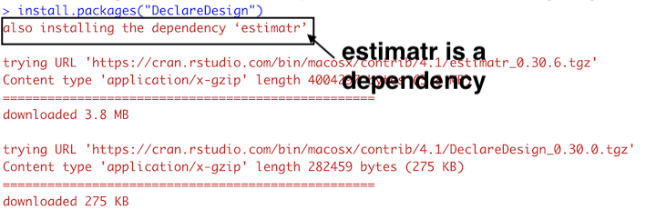
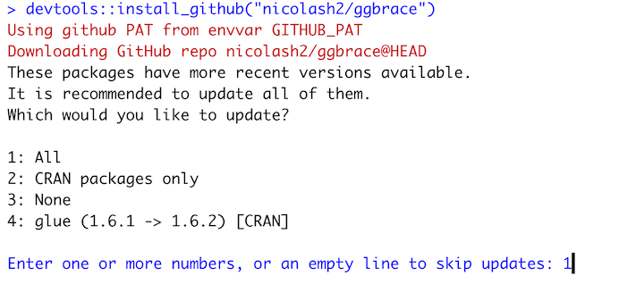
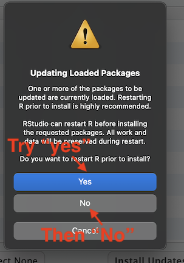
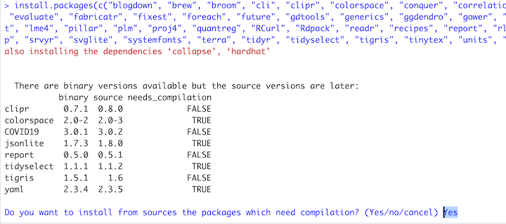
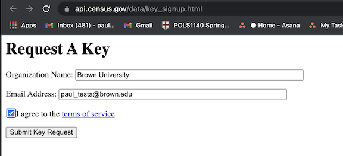
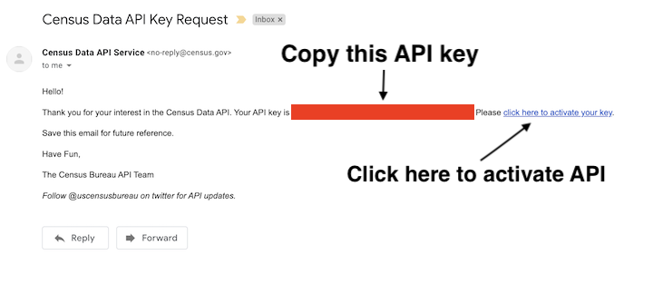
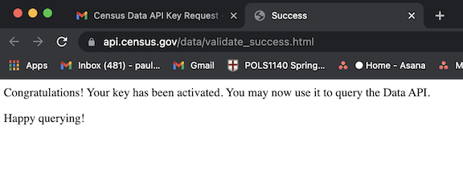

```{r setup, include=FALSE}
knitr::opts_chunk$set(echo = TRUE)
htmltools::tagList(
  xaringanExtra::use_clipboard(
    button_text = "<i class=\"fa fa-clipboard\"></i>",
    success_text = "<i class=\"fa fa-check\" style=\"color: #90BE6D\"></i>",
  ),
  rmarkdown::html_dependency_font_awesome()
)
```

# Overview {-}

This document provides instructions for installing the following packages:

- [`dataverse`](https://cran.r-project.org/web/packages/dataverse/vignettes/A-introduction.html#:~:text=The%20dataverse%20package%20is%20the,into%20the%20reproducible%20research%20workflow.){target="_blank"} a package to download and read files from dataverses like [Harvard's Dataverse](https://dataverse.harvard.edu/)


- [`DeclareDesign`](https://declaredesign.org/){target="_blank"} a set of packages useful for describing the properities of experimetnal and observational design

- [`tidycensus`](https://walker-data.com/tidycensus/index.html){target="_blank"} set of functions of that allow us to download data from the US Census' API

- [`easystats`](https://easystats.github.io/easystats/){target="_blank"} a set of packages like the `tidyverse` but for statistics.


These are useful packages, but in the past, I've found they don't play nicely with the simple `the_packages` `ipak(the_packages)` approach we take in class. 

Additionally, for `tidycensus`, each of you will need to request an API key from the Census and install it locally to your computers.


# Install the packages

In your console, please run each line of code separately

```{r, eval=F}
install.packages("dataverse")
```

```{r, eval=F}
install.packages("tidycensus")
```

```{r, eval=F}
install.packages("easystats", repos = "https://easystats.r-universe.dev")
```

```{r, eval=F}
install.packages("DeclareDesign")
```


- `R` will typically install and or/update a package's dependencies (other packages your package needs). 

```{r, echo=F }

```


-  Sometimes R will ask you where and how you want to install/update these dependencies. Type the number 1 into your console and hit enter (this should try to install everything). If you get an error try again typing 2, then, 3, then 4. 


```{r , echo=F}

```


- `R` may tell you need to restart `R` Try saying yes. If it doesn't start downloading, say no, see what happens. After the downloads are complete you may need to restart `R`

```{r , echo=F}

```


- `R` may then ask if you want to compile some packages from source. Type `Y` into your console. If this doesn't work, try again, but this time type `N` when asked

```{r, echo=F}

```

Again, this is a pain and sort of cryptic, but you only have to do it once. Sometimes you'll need to close and restart R for changes to take effect. Try working through these steps once or twice and if it still doesn't work, shoot me an email.

# Check your installation

If the installations went smoothly, you should see something like this when you run the following code:

```{r}
require(dataverse)
require(tidycensus)
require(DeclareDesign)
require(easystats)
```


If not, don't worry. These packages aren't strictly necessary for Thursday; You should be able to follow along with the slides, but just won't be able to download the data and run the code on your machine. 

We'll go over this in class on Thursday, and I can troubleshoot installation problems after class. 


# Install a Census API `tidycensus` package

To use the `tidycensus` package, you will need to do the following:

1. Install the `tidycensus` package
2. Load the installed package
3. Request an API key from the Census
4. Check your email
5. Activate your key
6. Install your API key in R
7. Check that everything worked

Steps 1 and 2 should be done. So let's walk through Steps 3-7:


## Request an API key from the Census

Click on this link: [https://api.census.gov/data/key_signup.html](https://api.census.gov/data/key_signup.html){target="_blank"}

And fill in the following information

- Organization: "Brown University"
- Email: `firstname_lastname@brown.edu`
- Agree to terms of service
- Submit request

```{r, echo=F}

```

## Check Email

You should receive an email like this:

```{r, echo=F}

```

- Click on the link to activate your API key

## Activate API key

- Clicking the link should take you to a page that looks like this

```{r, echo=F}

```


## Save API key in R

Go back to the email from the census

- Copy the string of letters and digits from the email (blocked out in red in the image above)
- This is your unique census API key
- Paste that string in between the quotation marks below and run `census_api_key()`

```{r, eval = F}
census_api_key("YOUR API KEY GOES HERE")
```

## Check that everything worked

- `census_api_key()` should save your unique API to your .Renviron file which `tidycensus` will use whenever you make ask the Census to Download data.

- If everything worked as planned, running `Sys.getenv("CENSUS_API_KEY")` should display your long API key

```{r, eval=F}
Sys.getenv("CENSUS_API_KEY")

```

And you should be able to use functions from `tidycensus` to download census data:

```{r}
age10 <- tidycensus::get_decennial(geography = "state", 
                       variables = "P013001", 
                       year = 2010)

head(age10)
```

You can read more about what `tidycensus` can do [here](https://walker-data.com/tidycensus/articles/basic-usage.html){target="_blank"}


